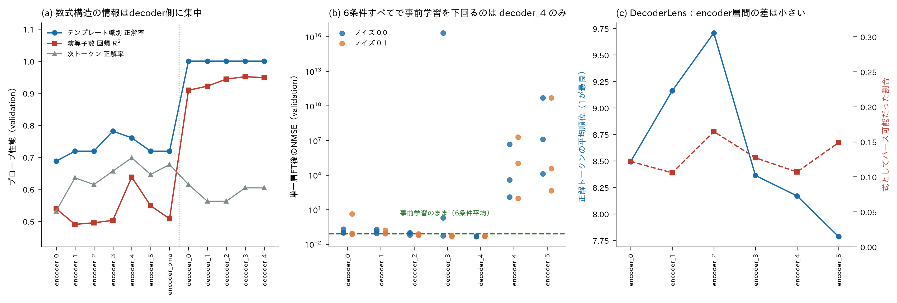
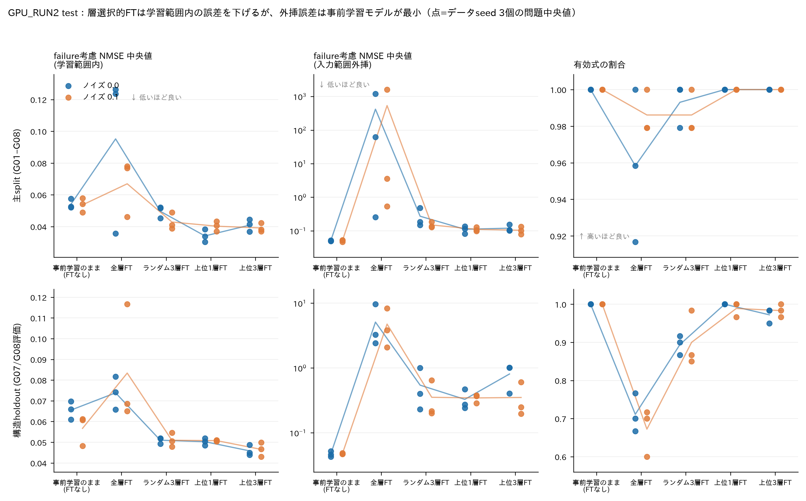
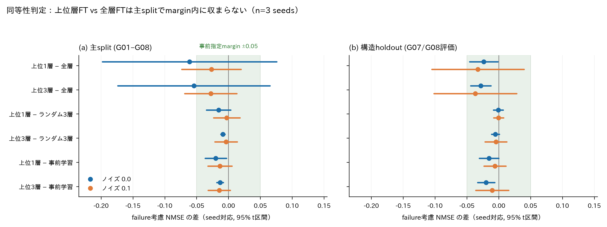
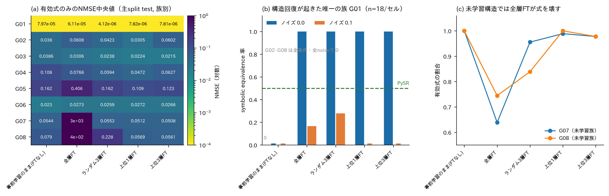

# LANSR研究：遺伝子制御ダイナミクスの発見に向けたニューラルシンボリック回帰の層別解析

> **現在地（2026年9月1日）** ：GPU_RUN2–5を完了した。GPU_RUN5は公開ODEFormerを閉じたHill型GRNへ適応し、
> validation 20,736 cell、final GRN 6,000 cell、ODEBench forgetting 3,780 cellを固定計画で評価した。
> 事前登録判定は6 hit / 1 missで、Go 8はNO-GOだったためDREAM4・実データへの追加実験は行っていない。
> GPU_RUN5の結果は [`GPU_RUN5/README.md`](GPU_RUN5/README.md) から辿り、評価世代の異なるGPU_RUN2–4の数値と混ぜない。
> GPU_RUN2は合成GNW式・oracle変数・解析的微分だけを使い、層解析と選択的fine-tuningを検証した実験である。
> 主結果は「適応はdecoder中後段、とくに `decoder_4` に局在する」「少数層FTは全層FTより数値精度・生成安定性が良い」
> 「しかし正しい式構造の回復はほぼ達成できていない」の3点である。
> 本READMEの主結果はすべてGPU_RUN2であり、GPU_RUN1とCPU pilotは[§12](#12-過去のrunの位置づけ)に履歴として要約するにとどめる。

## 目次

- [1. 研究概要](#1-研究概要)
- [2. 背景](#2-背景)
- [3. 研究上の問い](#3-研究上の問い)
- [4. 用語解説](#4-用語解説)
- [5. 評価指標](#5-評価指標)
- [6. 層解析手法](#6-層解析手法)
- [7. GPU_RUN2の実験設計](#7-gpu_run2の実験設計)
- [8. GPU_RUN2の結果](#8-gpu_run2の結果)
- [9. GPU_RUN2の考察](#9-gpu_run2の考察)
- [10. 仮説ごとの判定と結論](#10-仮説ごとの判定と結論)
- [11. 限界と読み方の注意](#11-限界と読み方の注意)
- [12. 過去のrunの位置づけ](#12-過去のrunの位置づけ)
- [13. 今後の展望](#13-今後の展望)
- [14. 再現方法](#14-再現方法)
- [15. リポジトリ構成](#15-リポジトリ構成)
- [16. 参考文献](#16-参考文献)

## 1. 研究概要

本研究は、遺伝子発現データから遺伝子制御ネットワーク（GRN）の動的方程式を求めるニューラルシンボリック回帰を対象に、
モデル内部のどの層が数式生成、変数選択、数値近似、式構造の回復を担うかを解析する研究である。
英語題目は次のとおりである。

> **Layer-wise Analysis of Neural Symbolic Regression for Discovering Gene Regulatory Dynamics**

### 1.1 研究目標

本研究の目標には、次の優先順位を置く。

1. **メイン目標：遺伝子制御ネットワークの動的方程式を求めるニューラルシンボリック回帰の層を解析する。**
   encoderとdecoderの各層について、表現probe、単一層fine-tuning、層ablation、activation介入、seed間順位安定性を測り、
   GRN動的方程式の生成に重要な層と、その役割を明らかにする。
2. **サブ目標1：シンボリック回帰としてのsymbolic recoveryの精度上昇。**
   NMSEだけでなく、exact recovery、skeleton recovery、symbolic equivalence、variable F1、valid rateを用い、
   数値的に近いだけの式ではなく、正しい変数と式構造を回復できる学習・探索方法を検討する。
3. **サブ目標2：遺伝子制御ネットワークの新たな方程式を発見する。**
   合成データで方法を検証した後、DREAM4とヒト時系列へ適用し、未知の制御関係を説明し得る候補方程式を提示する。
   ただし、holdoutでの再現、外挿安定性、特異点、既知生物学との整合性を検査するまでは、
   「真の方程式」や「因果機構」ではなく、検証対象となる候補方程式として扱う。

メイン目標はモデル内部の科学的理解、サブ目標1は方法性能の改善、サブ目標2は生物学的応用に対応する。
したがって、低い予測誤差だけで研究成功とは判定せず、層解析の再現性と式構造の回復を中心に評価する。

遺伝子 $i$ の発現量を $x_i(t)$ とすると、その時間変化を

```math
\frac{dx_i}{dt}=f_i(x_1,x_2,\ldots,x_p)
```

と表せる。本研究の目標は、未知の関数 $f_i$ を、ニューラルネットワーク内部の読めない計算としてではなく、
人間が読める数式として発見することである。

中心モデルには、事前学習済みTransformer型シンボリック回帰モデル **NeSymReS** を使う。
さらに、全パラメータを更新する代わりに、適応への寄与が大きい少数のTransformer層だけをfine-tuningする。
非ニューラル手法 **PySR** を比較対象とし、推論時探索 **TPSR** はGPU_RUN3以降の課題として保留している。

### 1.2 実験世代と本READMEの範囲

| 世代 | 内容 | 本READMEでの扱い |
|---|---|---|
| CPU pilot | パイプライン構築と問題発見のためのlegacy run | [§12](#12-過去のrunの位置づけ)に要約のみ |
| GPU_RUN1 | Colab L4、3 seeds、DREAM4・ヒト時系列まで含む探索的reduced run | [§12](#12-過去のrunの位置づけ)に要約のみ |
| **GPU_RUN2** | **ローカルRTX 2070、固定commit、合成GNW式のみの層解析run** | **§7–§11の主結果** |
| GPU_RUN3 | ND2の再現と層解析 | 本READMEの主結果と混ぜない。入口は [`GPU_RUN3/`](GPU_RUN3/) |
| GPU_RUN4 | 公開ODEFormer checkpoint（4+12 / 約61M）の再現と層解析。reduced Phase 0–9済み | 本READMEの主結果と混ぜない。入口は [`GPU_RUN4/README.md`](GPU_RUN4/README.md) |
| GPU_RUN5 | 同じ公開ODEFormerの閉じたHill型GRN適応、多軌道候補選択、formula-level層解析。Phase 0–9完了、Go 8 NO-GO | 固定計画とmanifest検証済み成果物は [`GPU_RUN5/README.md`](GPU_RUN5/README.md) から辿る。他世代のscoreと直接混ぜない |

評価設計が世代間で異なるため、**GPU_RUN2の数値を他世代と同一表に混ぜてはならない。**

研究計画の詳細は [`docs/plans/20260714_firstplan.md`](docs/plans/20260714_firstplan.md)、
GPU_RUN2の計画正本は [`GPU_RUN2/plan.md`](GPU_RUN2/plan.md)、実行入口は [`GPU_RUN2/README.md`](GPU_RUN2/README.md) にある。
GPU_RUN2の詳細レポートは次の2本であり、本READMEの§7–§11はこの2本を突き合わせ、保存recordで再検証したうえで要約したものである。

- [`GPU_RUN2/GPU_RUN2_research_report_20260816_claude-science.md`](GPU_RUN2/GPU_RUN2_research_report_20260816_claude-science.md)（事実・考察・提案を分離した監査型レポート）
- [`GPU_RUN2/GPU_RUN2_research_report_20260816_chatGPT.md`](GPU_RUN2/GPU_RUN2_research_report_20260816_chatGPT.md)（仮説判定と実装監査を中心にしたレポート）

## 2. 背景

### 2.1 GRNと遺伝子制御方程式

**Gene Regulatory Network（GRN、遺伝子制御ネットワーク）** は、遺伝子や転写因子の制御関係を表すネットワークである。
例えば、遺伝子 $A$ が遺伝子 $B$ の発現を増やすなら $A\rightarrow B$、減らすなら $A\dashv B$ と表す。
GRNを知ることは、細胞が刺激に応答する仕組み、病気で制御が崩れる仕組み、薬の標的候補を理解する助けになる。

多くのGRN推定法は「辺があるか」や「重要度はいくつか」を出力する。しかし、辺だけでは、制御が直線的なのか、
ある濃度で飽和するのか、複数因子が協力するのかまでは分からない。本研究は一歩進んで、制御関数そのものを推定する。

合成データでは、生物学でよく使われる **Hill型制御** を主に扱う。活性化の例は

```math
\frac{dx_i}{dt}
=\frac{\alpha x_j^n}{K^n+x_j^n}-\beta x_i
```

である。第1項は遺伝子 $j$ による生成、第2項は遺伝子 $i$ の分解を表す。

- $\alpha$：最大生成速度
- $K$：反応が半分程度に達する発現量
- $n$：応答の急さを表すHill係数
- $\beta$：分解速度

抑制の例は

```math
\frac{dx_i}{dt}
=\frac{\alpha K^n}{K^n+x_j^n}-\beta x_i
```

である。$x_j$ が大きくなるほど第1項が小さくなるため、遺伝子 $j$ が遺伝子 $i$ を抑える。
このように式が得られれば、制御の向きだけでなく、飽和、協同性、分解の強さまで議論できる可能性がある。

**この形が本研究の技術的な要点になる。** Hill型制御は分母に変数を含む**有理式**であり、
多項式では原理的に表せない飽和挙動を持つ。GPU_RUN2の最大の否定的結果は、まさにこの有理構造が回復できないことだった（[§9.2](#92-有理構造の欠落が回復失敗の中心にある)）。

実際の時系列データでは $dx/dt$ を直接観測できないため、隣接時点から有限差分で近似する。

```math
\left.\frac{dx}{dt}\right|_{t_k}
\approx \frac{x(t_{k+1})-x(t_k)}{t_{k+1}-t_k}
```

ただし、測定時点が少ない場合やノイズが大きい場合、この近似自体が大きな誤差源になる。
GPU_RUN2ではこの誤差源を切り離すため、有限差分を使わず解析的な真の微分値を教師値にした。

### 2.2 シンボリック回帰

通常の回帰は、直線や決められた形の式の係数を学習する。例えば線形回帰では

```math
\hat y=w_0+w_1x_1+w_2x_2
```

という形を人間が先に決め、 $w_0,w_1,w_2$ を求める。一方、 **シンボリック回帰（Symbolic Regression; SR）** は、
係数だけでなく、足し算、掛け算、割り算、べき乗などの組合せも探索する。

データ集合を $`D=\{(\mathbf{x}_i,y_i)\}_{i=1}^{N}`$ 、使える数式の集合を $\mathcal{F}$ とすると、概念的には

```math
f^*=\underset{f\in\mathcal{F}}{\mathrm{arg\,min}}\left[\frac{1}{N}\sum_{i=1}^{N}\bigl(y_i-f(\mathbf{x}_i)\bigr)^2+\lambda C(f)\right]
```

を解く。 $C(f)$ は式の長さや演算子数などの複雑度、
$\lambda$ は「精度」と「単純さ」のどちらを重視するかを決める値である。
単に誤差が小さいだけの巨大な式ではなく、短く説明しやすい式を探す点が重要である。

本研究の比較対象 **PySR** は、複数の式集団を進化させ、式の変形・簡約・定数最適化を繰り返す実用的なSRである [4]。

### 2.3 TransformerとNeSymReS

**Transformer** は、入力中のどの部分に注目するかを計算するattentionを中心としたニューラルネットワークである。
入力行列を $Q,K,V$ に変換するscaled dot-product attentionは、概略

```math
\mathrm{Attention}(Q,K,V)=\mathrm{softmax}\!\left(\frac{QK^{\mathsf T}}{\sqrt{d_k}}\right)V
```

で表される。Transformerは同じ形の層を複数積み重ねる。**encoder** は入力を内部表現へ変換し、
**decoder** はその表現から出力列を1記号ずつ生成する。

**NeSymReS** は、大量の人工数式と、その数式から作った数値点集合を使ってTransformerを事前学習する手法である [1]。
入力は順序を持たない点集合

```math
\{(\mathbf{x}_1,y_1),\ldots,(\mathbf{x}_N,y_N)\}
```

で、出力は数式を表すtoken列である。新しい問題を毎回ゼロから探索するのではなく、事前学習で得た
「よく現れる数式の形」をprior（事前知識）として使える点が特徴である。

NeSymReS論文は、大規模な手続き生成データによる事前学習がSRに利用できることを示した。
一方、事前学習分布と生物学的なGRN式の間にはずれがある。本研究は、そのずれを少数層のfine-tuningで埋められるかを調べる。
GPU_RUN2は、このずれが**層の選び方や学習量ではなく、事前学習の式prior自体に起因する可能性**を示した。

### 2.4 IOLE/層選択的fine-tuning

**fine-tuning（微調整）** は、事前学習済みモデルを目的データでもう一度学習し、専門分野へ適応させることである。
全層fine-tuningは柔軟だが、計算・メモリを多く使い、データが少ないと過適合する可能性がある。

本研究の直接の着想は、Zhangらの *Is One Layer Enough?* [3] である。この研究はLLMの強化学習後学習を
層ごとに調べ、改善が少数の中間層へ集中する場合を報告した。層 $l$ だけを学習した損失を $L_l$、
事前学習モデルを $L_{\mathrm{base}}$、全層学習を $L_{\mathrm{full}}$ とすると、損失が小さいほどよい場合の層寄与度を

```math
C_l=
\frac{L_{\mathrm{base}}-L_l}
{L_{\mathrm{base}}-L_{\mathrm{full}}}
```

のように表せる。 $C_l=1$ なら、その1層だけで全層学習と同程度の改善を回復したことになる。

**ただしこの定義は、全層学習が事前学習を改善することを前提にしている。**
GPU_RUN2では全層FTが事前学習より悪化したため分母が成立せず、正規化寄与度は全層でNaNになった（§8.3）。
この点はGPU_RUN1との重要な違いであり、層順位はraw scoreの順序としてのみ読む必要がある。

なお、この寄与度を含む**層解析の各手法の定義・数式・限界は [§6](#6-層解析手法) にまとめている。**
本節は「層選択的fine-tuningという技術が何か」までを扱う。

### 2.5 oracle条件による切り分け

**oracle条件** とは、本来は未知であるはずの情報を正解から与える理想化された設定である。
性能の上限を測り、パイプラインのどこがボトルネックかを特定するために使う。
GRNの式発見は複数の誤差源が直列につながっているため、この切り分けが不可欠である。

```text
発現データ → [1] 制御因子の選択 → [2] 微分値の推定 → [3] 数式の探索 → 予測式
```

GPU_RUN2は[1]と[2]をoracleにして、[3]だけを評価している。

| 誤差源 | 通常の実験 | GPU_RUN2 |
|---|---|---|
| [1] 制御因子（regulator）の選択 | 相関・LASSO・相互情報量などで推定し、誤りが混入する | **真の式に現れる変数だけを入力**（oracle変数） |
| [2] 微分値 $dx/dt$ の推定 | 有限差分などで近似し、少数時点では大きな誤差になる | **解析的な真式を直接評価**（有限差分不使用） |
| [3] 数式の探索・生成 | ここを評価したい | 評価対象 |

この設計により、GPU_RUN2で観測された失敗は[3]に帰属できる。逆に言えば、
**GPU_RUN2は[1]と[2]の性能について何も示していない** ため、実データへの転移可能性をこのrunから主張することはできない。
GPU_RUN1ではDREAM4でoracle変数条件を試したが、それでもNMSEが0.855–0.879と高く、
[1]だけがボトルネックではないことが分かっている（[§12](#12-過去のrunの位置づけ)）。

### 2.6 再現バイアスとnovel discovery

ニューラルSRには、**事前学習で見た式を思い出しているだけで、新しい式を発見していないのではないか**
という根本的な疑いがある。CTC-NSR [16] はこれを **reproduction bias（再現バイアス）** と呼び、
生成された式が学習corpusのテンプレートに含まれるか否かで、回復を2種類に分けることを提案した。

- **reproduced**：予測式の骨格が学習corpusに存在する。既知テンプレートの再利用。
- **novel**：予測式の骨格が学習corpusに存在しない。新しい構造の生成。
- **novel recovery**：novelな予測で、なおかつ正解と一致したもの。**これが真の発見能力に対応する。**

NeSymReSの100M事前学習corpusは公開されていないため、GPU_RUN2ではこの判定を
**今回のfine-tuning corpusに対するtemplate membership** として実装した
（[`src/evaluation/reproduction_bias.py`](src/evaluation/reproduction_bias.py)）。
判定は完全一致文字列、定数を除いた骨格、symbolic equivalenceの3水準で記録する。

したがってGPU_RUN2の再現判定は「事前学習corpusからの再現」ではなく「fine-tuning corpusからの再現」であり、
CTC-NSR本来の設定より狭い。ただし、**novel recoveryが0であれば、少なくともこのrunで新構造の発見は起きていない**
という否定的な結論は成立する（§8.8）。

### 2.7 DREAM4とGeneNetWeaver

**GeneNetWeaver（GNW）** は、実在する大腸菌・酵母ネットワークから部分構造を取り出し、
転写・翻訳、制御、分子ノイズ、実験ノイズを含む動力学モデルを与えるシミュレータである [5]。
**DREAM4 In Silico Network Challenge** [6] のin silicoデータもGNWで生成された。

GPU_RUN2では、DREAM4の公開時系列そのものではなく、**GNW由来の制御則を持つ8つの式族（G01–G08）を解析的に生成** し、
真の式・真の微分値・真の制御因子がすべて既知の理想条件で層解析を行った。
DREAM4本体とヒト時系列への転移はGPU_RUN3以降へ保留している。

### 2.8 関連研究と本研究の位置づけ

- **NSRS（NeSymReS）** はTransformerの大規模事前学習をSRへ導入した [1]。
- **TPSR** はMCTSでTransformerの数式生成を計画問題として改善した [2]。
- **PySR** は進化的探索による強力な非ニューラル比較対象である [4]。
- **ScaleSR** は多変数SRを低次元問題へ分解し、toggle switchやrepressilatorも扱った [7]。
- **LNSR**、**NSRforCND（PI-NDSR）**、**ND2**、**ODEFormer** は、ニューラルSRをネットワーク動力学やODE発見へ拡張している
  [9–12]。本研究は、それらの予測性能だけでなくTransformer内部の層ごとの役割を主対象にする。
- **TSRM**、**DecoderLens**、**CKA**、probeとactivation patchingの研究は、層表現と因果的寄与を区別して
  解釈する方法を与える [8, 14–19]。GPU_RUN2のPhase 3–4はこれらの方法を直接使っている。
- **CTC_NSR** は、ニューラルSRが事前学習corpusの式を再現しているだけではないかという再現バイアスの問題を提起した [16]。
  GPU_RUN2はこの枠組みをfine-tuning corpusに対して適用した。
- **SINDy**、**SINDy-PI**、**WeakF（WeakIdent）**、**D-CODE** は、観測軌道から支配方程式を回復する別系統の方法であり、
  導関数推定と疎な式回復の比較基準になる [22, 23, 26, 31]。
- **SRBench**、**BSR（Boolformer）**、**ESRT**、**CNSR**、**NGDSN（DySymNet）**、**DGSR** などは、
  探索方式、制約、生成モデルの異なるSR比較対象を提供する [20, 21, 27, 28, 32, 35]。
- **TED** は、数式を根付き木として表し、葉の変数名の対応（代入 $\theta$）を最小化したうえで木編集距離を測る
  **変数付き木編集距離**を定義した [36]。さらに一階微分方程式系どうしの距離 $Dist$ とその緩和 $Pdist$ へ拡張し、
  BioModels の生物モデル間で実際に計算している。本研究にとってこれが最重要な位置を占める理由は、
  GPU_RUN2の中心的な失敗が **式構造の回復**（[§8.7](#87-式構造の回復)）にあり、
  現在の exact / skeleton recovery は0/1判定のため「どれだけ外したか」を区別できないことである。
  TEDは予測式と真の式の距離を連続量として与え、変数の入れ替えに対して頑健であるため、
  この飽和した指標を置き換える直接の候補になる。

本研究の新規性は個々の技術そのものではなく、次の組合せにある。

1. GRN動的方程式を求めるニューラルSRのencoder/decoder層を、性能順位だけでなくprobe、ablation、
   表現類似度、層介入によって解析する。
2. 層解析の知見を使ってsymbolic recoveryを改善し、全層・random層・非ニューラルSRと公平に比較する。
3. 数値近似（prediction）と構造発見（discovery）を同一benchmark上で分離して観測し、失敗の所在を特定する。

## 3. 研究上の問い

1. GRN動的方程式の入力表現、変数選択、token生成、式構造回復は、NeSymReSのどの層に担われるか。
2. 層の表現probe、fine-tuning、ablation、activation介入は同じ重要層を示し、その順位はseedやnoiseを越えて安定するか。
3. 高寄与層だけのfine-tuningは、全層・random層より効率的で、symbolic recoveryも改善するか。
4. 選択的fine-tuning、演算子制約、探索方法は、NMSEだけでなくexact/skeleton recoveryと生成安定性を改善するか。
5. 学習領域内の数値精度改善は、未知構造への外挿や真の式構造の回復につながるか。
6. 合成GRNで得た層解析と方法改善は、DREAM4やヒト時系列へ転移し、新しい候補方程式の発見につながるか（GPU_RUN3以降）。

## 4. 用語解説

| 用語 | 高校生向けの説明 |
|---|---|
| **Ablation** | ある層の出力を0などへ置き換えて壊し、性能がどれだけ落ちるかで、その層の必要性を測る操作。 |
| **Activation intervention / 介入** | 層の活性化を平均値などへ差し替え、出力がどう変わるかを見る因果的な解析。ablationより穏やかな破壊。 |
| **Attention** | 入力の各部分について「今の出力を作るとき、どこをどれだけ重視するか」を計算する仕組み。 |
| **Catastrophic forgetting / 破滅的忘却** | 新しいデータで学習した結果、以前できていたことができなくなる現象。全層FTで起こりやすい。 |
| **Beam search** | 途中まで作った候補を複数残し、良さそうな候補を枝分かれさせながら完成形を探す方法。 |
| **BFGS / Broyden–Fletcher–Goldfarb–Shanno algorithm** | 数式に含まれる数値定数を、誤差が小さくなるように調整する最適化アルゴリズム。4人の研究者の姓に由来する。 |
| **CE / Cross-Entropy** | 正解tokenに高い確率を付けられたかを測る学習誤差。小さいほどよい。 |
| **Checkpoint** | 学習済みモデルの重みを保存したファイル。ゲームのセーブデータに近い。 |
| **CKA / Centered Kernel Alignment** | 2つの層の内部表現がどれだけ似た幾何構造を持つかを測る指標。1に近いほど似ている。 |
| **Complexity / 式複雑度** | 式に含まれる演算子・変数・定数などのノード数。小さいほど単純で、説明しやすい式とみなす。 |
| **Control task** | probeが本当に層の情報を読んでいるかを確かめるため、意味のないラベルを当てて比較する対照課題。 |
| **CUDA / Compute Unified Device Architecture** | NVIDIAが提供する、GPUで汎用計算を行うための並列計算基盤。 |
| **Decoder** | Transformerのうち、数式tokenを順番に出力する側。GPU_RUN2ではここが適応の中心だと分かった。 |
| **DecoderLens** | encoderの途中の層の表現を直接decoderへ渡し、その時点で何が読めるかを見る解釈手法。 |
| **Domain-ID / Domain-OOD** | IDは学習に使った入力範囲内、OODはその外側の範囲での評価。外挿の安定性を測る。 |
| **Domain shift** | 学習データと本番データの性質が異なること。事前学習の人工式と生物学的なGRN式の差など。 |
| **DREAM4** | 正解ネットワーク付きの人工遺伝子発現データを使うGRN推定ベンチマーク。GPU_RUN3以降で扱う。 |
| **Early stopping** | validationの成績が改善しなくなったら学習を早めに止め、過適合を抑える方法。 |
| **Encoder** | Transformerのうち、入力された数値点集合を内部表現へ変換する側。 |
| **Epoch / 学習率** | epochは学習データを何周したかの回数、学習率は1回の更新でパラメータをどれだけ動かすかの幅。どちらもhyperparameter。 |
| **Equivalence margin / 同等性margin** | 「実質的に同じ性能」と認める差の幅。実験前に決め、信頼区間が完全に収まった場合だけ同等と判定する。 |
| **Failure-aware / penalized NMSE** | 数式の生成に失敗した問題を除外せず、大きな罰則値（$10^6$）を入れてから集計した誤差。 |
| **Fail-fast** | 必須条件が崩れたとき、古い設定などで処理を続けず、その場で明確なエラーとして停止する設計。 |
| **Family / 式族（G01–G08）** | 同じ構造を持つ式のまとまり。GPU_RUN2では8族×30 variantを生成し、族単位で構造の一般化を評価した。 |
| **FD / Finite Difference** | 隣り合う時点の値の差から変化率を近似する方法。有限差分。GPU_RUN2では不使用。 |
| **FT / Fine-Tuning** | 既に学習したモデルを、目的に合う少量のデータで追加学習すること。 |
| **Generalization / 汎化** | 学習に使っていないデータでも正しく働くこと。 |
| **GNW / GeneNetWeaver** | DREAM系の人工GRNと発現データを生成するソフトウェア。GPU_RUN2の8式族の出所。 |
| **GRN / Gene Regulatory Network** | 遺伝子同士の活性化・抑制関係を表すネットワーク。 |
| **Hill式** | 遺伝子制御の飽和やスイッチらしい応答を表す代表的な数式。分母に変数を含む有理式になる。 |
| **Hyperparameter** | 学習率やepoch数など、モデルがデータから覚えるのではなく実験者が候補を決める設定。 |
| **IOLE / Isolated One-Layer Estimation** | 1層だけをfine-tuningして性能を測り、その層の適応可能性を評価する手続き。 |
| **ISAB / PMA** | Set Transformer [13] の構成要素。ISABは点集合を処理するブロック、PMAは集合全体を固定長へまとめるpooling。NeSymReSのencoderがこの構造を使う。 |
| **LANSR / Layer-wise Analysis of Neural Symbolic Regression** | 遺伝子制御ダイナミクスの発見に向け、ニューラルシンボリック回帰モデルを層別に解析する本研究の略称。 |
| **Manifest / provenance** | 実行環境、commit、checkpointのhash、seedなど、その結果がどう作られたかを記録したファイルと、その記録性のこと。 |
| **MCTS / Monte Carlo Tree Search** | 試しの先読みを繰り返して有望な枝を探す木探索。 |
| **NeSymReS / Neural Symbolic Regression that Scales** | 数値点集合から数式を生成する、事前学習済みTransformer型SR。 |
| **NMSE / Normalized Mean Squared Error** | 平均二乗誤差をデータのばらつきで正規化した指標。0に近いほどよい。 |
| **Novel recovery** | 学習corpusに無い構造の式を新しく作り、しかも正解と一致させられた割合。真の発見能力に相当する。 |
| **ODE / Ordinary Differential Equation** | 常微分方程式。時間変化を記述する方程式。 |
| **Operator allowlist** | 生成してよい演算子の一覧。GPU_RUN2では四則演算と整数べきだけを許した。 |
| **Oracle条件 / Oracle変数** | 本来は未知の正解情報を与える理想条件。GPU_RUN2では真の式に現れる変数だけを入力し（oracle変数）、真の微分値を教師にして、変数選択と微分推定の誤差を切り離した。 |
| **Overfitting** | 学習データには合うが、未知データでは悪くなること。過適合。 |
| **Paired comparison / 対応のある比較** | 同じseed・同じ問題どうしで条件を比べる方法。条件以外の違いを打ち消せるため、少数seedでも差を見やすい。 |
| **Preflight** | 本実験の前に、環境・checkpoint・設定・出力形式が揃っているかを確認する事前検査。 |
| **Probe** | 層の内部表現に小さな線形モデルを当て、その層から何の情報が読み出せるかを測る解析。 |
| **PySR** | 進化計算で数式を探索するライブラリ。本研究の主要な非ニューラル比較対象。 |
| **R² / Coefficient of Determination** | 決定係数。予測がデータの変動をどれだけ説明できたかを表し、1に近いほどよい。 |
| **Regularization / 正則化** | 学習の自由度を制限し、過適合を抑える工夫。少数層FTは事前学習priorを保つ正則化として働き得る。 |
| **Reproduction bias / 再現バイアス** | 学習で見た式をそのまま出しているだけで、新しい構造を発見していない状態。 |
| **Ridge回帰** | 係数が大きくなりすぎないよう罰則を加えた線形回帰。probeの当てはめに使う。 |
| **Seed** | 乱数の初期値。同じseedなら同じランダム処理を再現しやすい。 |
| **SHA-256** | ファイル内容から固定長の識別値を作る方式。checkpointやarchiveが同一か確認するために使う。 |
| **Spearman / Kendall順位相関** | 2つの順位づけがどれだけ似ているかを測る指標。1で完全一致、0で無関係、−1で逆順。 |
| **Skeleton recovery** | 数値定数を一般定数に置き換えた式の骨格が正解と一致したか。 |
| **Structure holdout** | 一部の式族をまるごと学習から外し、未知の構造へ一般化できるかを測る分割。 |
| **Studentのt分布 / 95%信頼区間** | 少数標本で平均の不確かさを見積もる分布と、その区間。seedが3個の本runでは区間が非常に広くなる。 |
| **Symbolic equivalence** | 見た目が違っても数式として同値だと判定できたか。 |
| **Symbolic recovery** | 予測値だけでなく、正解と同じ数式構造を回復できたかという評価。 |
| **SymPy / simplify** | Pythonの数式処理ライブラリと、その式簡約機能。予測式と真式の一致判定に使うが、簡約が終わらないことがある。 |
| **SR / Symbolic Regression** | データを説明する、人間が読める数式そのものを探索する回帰。 |
| **Token** | 数式をモデルが扱える小単位へ分けたもの。変数、演算子、括弧など。 |
| **Token mask** | 生成中に、許可していないtokenの確率を0にして選ばせない仕組み。GPU_RUN2の演算子制限はこれで強制した。 |
| **Tie / 同順位** | 複数の層が同じスコアになり順位を決められない状態。罰則値への飽和で起こり、順位相関を見かけ上高くする。 |
| **TPSR** | Transformerの候補確率を使い、MCTSで数式を先読み探索する手法。GPU_RUN3以降で再導入。 |
| **Valid rate / 有効式率** | 生成した式のうち、構文解析と数値評価に成功した割合。 |
| **Validation / Test** | validationは方法や設定の選択用、testは最後の性能確認用。testで方法を選ぶと評価が甘くなる。 |
| **Variable F1** | 真の式に必要な変数を、予測式がどの程度過不足なく含むかを測るF1指標。 |
| **Wall time / 実時間** | 実際に経過した時間。GPUの計算時間だけでなく、待ち時間も含む。 |

## 5. 評価指標

真値を $y_i$ 、予測を $\hat y_i$ 、真値の平均を $\bar y$ とする。

### NMSE

```math
\mathrm{NMSE}=\frac{\sum_{i=1}^{N}(y_i-\hat y_i)^2}{\sum_{i=1}^{N}(y_i-\bar y)^2+\varepsilon}
```

0が完全一致で、小さいほどよい。1付近は「平均値だけを予測する」のと同程度である。

### 決定係数 $R^2$

```math
R^2=1-\frac{\sum_{i=1}^{N}(y_i-\hat y_i)^2}{\sum_{i=1}^{N}(y_i-\bar y)^2+\varepsilon}
```

1が完全一致、0は平均値予測と同程度、負値は平均値予測より悪い。

### failure-aware（penalized）NMSEの中央値

GPU_RUN2の主指標は**平均ではなく中央値**である。decodeに失敗した問題を除外せず、
NMSE $=10^6$、$R^2=-1$ 相当の罰則を入れてから中央値を取る。

```math
\mathrm{NMSE}^{\mathrm{pen}}_i=
\begin{cases}
\mathrm{NMSE}_i & \text{式が有効な場合}\\
10^{6} & \text{decode失敗の場合}
\end{cases}
,\qquad
\text{主指標}=\mathrm{median}_i\bigl(\mathrm{NMSE}^{\mathrm{pen}}_i\bigr)
```

この設計には利点と欠点がある。利点は、極端な有限外れ値に平均が支配されるのを防ぎつつ、失敗を無視しないこと。
欠点は、**失敗率が50%未満なら中央値は罰則値に届かないため、2–3割失敗していても中央値は良好に見える** ことである。
したがって本READMEでは、NMSEと有効式率を必ず併記する。

### domain-IDとdomain-OOD

学習に使った入力範囲 $[0.1, 2.0]$ 内で評価したものをdomain-ID、
より広い範囲 $[0.05, 2.5]$ で評価したものをdomain-OODと呼ぶ。
式として正しければ両方で良いはずであり、**IDだけ良くOODが悪い場合は、局所的な数値近似にすぎない** ことを示す。

### 式回復と複雑度

- **exact recovery**：文字列または簡約後の式が正解と完全一致するか。定数の末尾桁まで一致する必要がある。
- **skeleton recovery**：数値定数を一般定数に置き換えた式構造が一致するか。
- **symbolic equivalence**：見た目が異なっても数式として同値と判定できるか。
- **complexity**：演算子・変数・定数などのノード数。小さいほど単純である。
- **valid rate**：生成した式のうち、構文解析と数値評価に成功した割合。
- **reproduced / novel**：予測式の骨格がfine-tuning corpusに存在するか否か。novelな式で正解へ到達した割合が**novel recovery**である。
- **変数付き木編集距離（TED [36]）**：式木を編集して他方の式木に一致させるのに必要な最小コスト。
  葉の変数名の対応は代入 $\theta$ について最小化するので、変数の並べ替えだけが違う式は距離0になる。
  上記の exact / skeleton recovery が0/1で飽和する場面で、構造の近さを連続量として区別できる。
  無順序木では厳密計算がNP困難であり、原論文はILPによる実用解法と、方程式系単位の距離 $Dist$・$Pdist$ を与えている。
  **GPU_RUN2ではこの指標を計測していない。** 導入は再解析候補（[§13.1](#131-保存済みrecordだけで実施できる再解析gpu再実行不要)）である。

### 変数回復

```math
\mathrm{Precision}=\frac{TP}{TP+FP},\qquad\mathrm{Recall}=\frac{TP}{TP+FN},\qquad
F_1=\frac{2\,\mathrm{Precision}\,\mathrm{Recall}}{\mathrm{Precision}+\mathrm{Recall}}
```

GPU_RUN2はoracle変数を与えているため、variable F1は0.95–0.999と高く、識別力を持たない補助指標である。

## 6. 層解析手法

本節は、層の役割を測るために本研究が使う**手法そのもの**の定義・数式・限界をまとめる。
どのデータでどの条件により実行したかは [§7](#7-gpu_run2の実験設計)、実測値は [§8](#8-gpu_run2の結果) にある。
層選択的fine-tuningという技術自体の背景は [§2.4](#24-iole層選択的fine-tuning) を参照する。
実装は [`src/interpretability/`](src/interpretability/) と [`src/training/single_layer.py`](src/training/single_layer.py) にある。

本研究の中心は「どの層が何をしているか」を測ることである。ここで使う手法は、大きく
**相関的手法**（層の中に情報があるかを見る）と **因果的手法**（層を操作して出力が変わるかを見る）に分かれる。
両者は別のことを測るため、一致するとも限らない。GPU_RUN2はこの6種類をすべて同じrunの中で実行した。

| 手法 | 種類 | 測るもの | 実装 | 主要文献 |
|---|---|---|---|---|
| 線形probe | 相関 | 層表現から数式の属性が線形に読めるか | [`src/interpretability/probes.py`](src/interpretability/probes.py) | DIP [17]、TSRM [8] |
| CKA | 相関 | 層どうしの表現の幾何が似ているか | [`src/interpretability/cka.py`](src/interpretability/cka.py) | CKA [15] |
| DecoderLens | 相関＋生成 | encoder中間表現の段階で何が出力できるか | [`src/interpretability/decoder_lens.py`](src/interpretability/decoder_lens.py) | DecoderLens [14] |
| 層ablation | 因果 | 層を壊すと性能がどれだけ落ちるか | [`src/interpretability/interventions.py`](src/interpretability/interventions.py) | BPAP [18]、HUIAP [19] |
| activation介入 | 因果 | 層の活性化を差し替えると出力がどう変わるか | [`src/interpretability/interventions.py`](src/interpretability/interventions.py) | BPAP [18]、HUIAP [19] |
| 単一層FT（IOLE） | 適応可能性 | その層だけ学習して性能が上がるか | [`src/training/single_layer.py`](src/training/single_layer.py) | IOLE [3]、LASF [30] |

### 6.1 線形probe（probing）

**probe（プローブ）** は、凍結したモデルの中間表現 $h^{(l)}$ に小さな線形モデルを当て、
その層から特定の情報が読み出せるかを測る手法である [17]。
層 $l$ の表現から属性 $y$ を予測する重み $W$ を、ridge回帰

```math
\hat W=\underset{W}{\mathrm{arg\,min}}\;\lVert h^{(l)}W-y\rVert^2+\lambda\lVert W\rVert^2
```

で求め、**その層を学習させずに**、正解率や $R^2$ で評価する。
高いスコアは「その情報が層表現に線形に符号化されている」ことを示すが、
**モデルが実際にその情報を使っているかまでは示さない。** ここが因果的手法との決定的な違いである。
また、probeが強力すぎると層に情報が無くてもタスクを解けてしまうため、
Hewitt & Liang [17] は control task と比較して probe の選択性を評価することを提案している。
**GPU_RUN2ではこの control task を実施していないため、probeスコアの絶対値は probe 自身の表現力を含む。**

GPU_RUN2では次の3タスクをvalidationデータだけで実行した。

1. **代数テンプレート識別**：その式がどの構造クラス（族）に属するかの多クラス分類。
2. **演算子数回帰**：式に含まれる演算子の個数を予測する回帰。式の複雑さの符号化を測る。
3. **次トークン識別**：次に出力すべき数式tokenの分類。生成の直近の手がかりを測る。

**validation内でprobeのfit用と評価用の例を分離**しており、同じ例で学習と採点をしていない。
Transformer型SRモデルの内部をprobeで解析する先行研究としてTSRM [8] があり、本研究はそれをGRN動的方程式へ適用したものにあたる。

### 6.2 CKA（表現類似度）

**CKA（Centered Kernel Alignment）** は、2つの層の内部表現行列 $X, Y$（行が同じ例に対応）が
どれだけ似た幾何構造を持つかを、次元数が違っても比較できる形で測る指標である [15]。列を中心化したうえで

```math
\mathrm{CKA}(X,Y)=\frac{\lVert X^{\mathsf T}Y\rVert_F^2}{\lVert X^{\mathsf T}X\rVert_F\,\lVert Y^{\mathsf T}Y\rVert_F}
```

と計算する。1に近いほど似ている。CKAは
「どの層とどの層が実質的に同じ表現を作っているか」「表現が大きく変わる境目はどこか」を見るのに使う。

**注意すべきは、CKAが高いことと、特定の情報が読み出せることは別概念である** という点である。
GPU_RUN2ではencoder全層のCKAが0.94–0.97と高い一方、probeスコアの順位とはほとんど対応しなかった
（§8.2）。表現の幾何が似ていても、線形に読める属性は層ごとに違い得る。

### 6.3 DecoderLens

**DecoderLens** は、encoder-decoder型Transformerの解釈手法で、
**encoderの途中の層の出力を、最終層の出力の代わりにdecoderへ渡して実際に出力を生成させる** [14]。
「この時点でモデルは何を言えるようになっているか」を、内部ベクトルではなく人間が読める出力の形で観察できる。

本実装（[`decoder_lens.py`](src/interpretability/decoder_lens.py)）では、
各encoder ISAB層の出力を最終のPMA pooling（`outatt`）へ通してからdecoderのcross-attention memoryとして与える。
追加学習は一切行わない。各decode stepについて、上位候補token、正解tokenの順位、
途中までのtoken列、式としてパースできたかを保存する。

**限界**：decoderは本来「最終encoder表現」を受け取るように学習されているため、
中間表現を渡すことはdistribution shiftを与える。したがってパース率の低さ（GPU_RUN2では12.6%）を
通常のdecode性能として解釈してはならない。層間の**相対比較**にのみ使う。

### 6.4 層ablation

**ablation（アブレーション）** は、ある層の出力を0などの情報を持たない値へ置き換え、
その状態で推論して性能がどれだけ落ちるかを測る因果的手法である。
落ち幅が大きいほど、その層は出力の生成に必要だといえる。

```math
\Delta_l^{\mathrm{abl}}=\mathcal{M}\bigl(\text{ablate}(l)\bigr)-\mathcal{M}(\text{baseline})
```

GPU_RUN2では **zero ablation**（層出力を全て0にする hard ablation）を使った。

**限界が2つある。** 第一に、hard ablationはモデルを学習時に一度も経験していない状態へ追い込むため、
「その層が担う機能」ではなく「壊れたモデルの挙動」を測ってしまう危険がある [19]。
第二に、失敗に罰則値を入れる評価では、複数の層が同じ上限値へ**飽和**して差が消える。
GPU_RUN2では `decoder_1/3/4` がいずれも $10^{6}$ に張り付き、この3層の相対的重要度は識別できなかった。

### 6.5 activation介入（activation patching）

**activation patching / activation介入** は、ablationより穏やかな因果的手法である。
層の活性化を、別の入力から取った活性化や、平均活性化などの「情報を持たない基準値」へ差し替えて、
出力の変化量を測る [18, 19]。実装は次の2種類を持つ。

```math
\text{平均置換：}\;\tilde h^{(l)}=\overline{h^{(l)}},\qquad
\text{線形補間：}\;\tilde h^{(l)}=(1-\alpha)h^{(l)}_{\mathrm{src}}+\alpha h^{(l)}_{\mathrm{dst}}
```

GPU_RUN2の主実行は**平均活性化への置換**を使った。介入効果は

```math
\delta_l=\mathcal{M}(\text{baseline})-\mathcal{M}(\text{intervened})
```

と定義する（NMSEのように小さいほど良い指標では、$\delta_l$ が大きく負であるほど劣化が大きい）。

**符号の向きが解釈の分かれ目になる。** GPU_RUN2の保存rankingは、この $\delta_l$ を降順に並べていたため、
実際には「劣化の小さい層」＝介入に頑健な層が上位に来ていた。
importanceとして読むには、劣化量の大きい順へ並べ直す必要がある（詳細は§8.3の警告）。
活性化介入の指標設計と落とし穴は Zhang & Nanda [18]、Heimersheim & Nanda [19] が整理している。

### 6.6 単一層fine-tuning（IOLE）と層寄与度

§2.4で述べた層選択的fine-tuningを、1層ずつ独立に実行する手続きを
本研究では **IOLE（Isolated One-Layer Estimation）** と呼ぶ [3]。
他の全パラメータを凍結し、層 $l$ だけを学習して性能 $L_l$ を測る。

IOLEが測るのは、probeやablationとは別の量である。

- probe：その層に情報が**あるか**（現状の読み出し可能性）
- ablation / 介入：その層が出力生成に**必要か**（現状の因果的依存）
- IOLE：その層を動かせば新しい領域へ**適応できるか**（可塑性・適応可能性）

したがって「重要な層」という言葉は3通りの意味を持ち得るため、本READMEでは常にどの手法による重要度かを明示する。
教師ありfine-tuningの層別効果については、LLMを対象にした層別解析 [30] も参照した。

### 6.7 手法間の一致をどう読むか

複数手法が同じ層を指したときに初めて「その層の役割」といえる。ただし一致の解釈には注意が必要である。

- 相関的手法（probe、CKA）と因果的手法（ablation、介入）は**別の量**を測るので、不一致は矛盾ではない。
- 罰則値への飽和や同順位（tie）があると、順位相関は見かけ上高くなる。Spearman = 1.0を「完全再現」と読んではならない。
- 順位の**向き**（重要度順か頑健性順か）を実装レベルで確認しないと、結論が反転する。

GPU_RUN2ではまさにこの3点すべてが実際に問題になった（§8.3、§9.3）。

## 7. GPU_RUN2の実験設計

### 7.1 目的と除外事項

GPU_RUN2は、GPU_RUN1で未解決だった次の3点を、**理想化された合成問題だけに限定して**検証する実験である。

1. encoder・decoder各層の役割を、probe、単一層FT（IOLE）、ablation、CKA、activation介入、DecoderLensから解析する。
2. 少数の重要層だけをfine-tuningする条件を、全層FTおよび事前固定random FTと比較し、数値精度とsymbolic recoveryの両方で評価する。
3. 真式と予測式をproblem単位で直接比較できる成果物を保存する。

次のものは**意図的に除外**した。有限差分による微分近似、DREAM4、ヒト時系列、経験的なregulator selector、
実データからの新規候補式提案、TPSR、NSR-gvs、large beamその他のtest-time computation。

したがって本runは実データ適用の結論を出す実験ではなく、**NeSymReS内部解析と合成GRN式への適応を分離して検証するmechanistic run** である。

### 7.2 実行provenance

| 項目 | 実値 |
|---|---|
| run ID | `gpu_run2_20260815_1d91927` |
| 実行日 | 2026-08-15 – 2026-08-16 |
| source commit | `1d919278b61172bec9e09465e7c04e3c46ef0892`（Phase 5の再現バイアス集計のみ `e6348ae9` で継続実行） |
| Python / PyTorch | 3.10.20 / 2.5.1+cu124 |
| GPU / CPU | NVIDIA GeForce RTX 2070 / Intel Core i7-8700 |
| OS | Linux 7.0.0-29-generic x86_64 |
| NeSymReS checkpoint | `100M.ckpt`, SHA256 `62aedc41fdb67ecbe3679f5ef030e7ef2bf0f4471c461b68d8814358968b324f` |
| GNW source commit | `5016f55ab04c111f29d7d0b3a4881d4725d49467` |
| decode timeout | 30 s / problem（実際のtimeoutは0件） |
| seed bundle | (data 101, model 0) / (data 202, model 1) / (data 303, model 2) |
| noise | 0.0 と 0.1 の2条件（混ぜて集計しない） |

結果を再現・議論するときは、リポジトリの最新mainではなく上記のsource commitを基準にする。

### 7.3 合成データ（GNW由来8式族）

Phase 1はGNW由来のHill型8族、計240 problem（族あたり30 variant）を生成した。

| 族 | 変数数 | 構造 |
|---|---|---|
| G01 | 1 | 基底転写＋分解 $\dot{x}_1 = a - a x_1$（唯一の線形族） |
| G02 | 2 | 単一活性化因子のHill型 |
| G03 | 2 | 単一抑制因子のHill型 |
| G04 | 3 | 独立な2活性化因子 |
| G05 | 3 | 複合体を作る2活性化因子 |
| G06 | 3 | 活性化因子＋不活性化因子 |
| G07 | 3 | enhancer＋repressorの2モジュール混合 |
| G08 | 3 | 2つのenhancerモジュールの混合 |

**G01を除くすべての族の真の式は、分母に変数を含む有理式である**（主split test 48 problemで確認：G01が0/6、G02–G08が6/6）。
これは全problemの87.5%にあたる。

### 7.4 split設計

| split | 構成 | test規模 |
|---|---|---|
| 主split（`main`） | 族内でvariantを 18 train / 6 validation / 6 test へ分割 | 48 problem × 3 seed = 144 record／noise |
| 構造holdout（`structure_holdout`） | train = G01–G05、validation = G06、**test = G07・G08（完全未学習）** | 60 problem × 3 seed = 180 record／noise |

構造holdoutでは、G07・G08を層選択にもhyperparameter選択にも一切使っていない。

### 7.5 入力・教師値・演算子制約

- oracle regulatorのみをNeSymReS/PySRへ入力する（対象遺伝子 $x_i$ は常に入力）。
- 解析的な真式 $f(x)$ を直接評価して教師値を作る。**有限差分は不使用。**
- 学習点 1,024、decode入力点は全手法・全条件で同一の80点に固定。
- 性能評価は独立した点集合で行う。domain-ID 256点（範囲 $[0.1,2.0]$）、domain-OOD 256点（範囲 $[0.05,2.5]$）。
- 演算子allowlistは add, sub, mul, div, 整数べき $2$–$5$, 定数のみ。
  `sin`, `cos`, `tan`, `exp`, `log`, `sqrt`, `abs` は全面禁止し、beam生成中のtoken maskでも禁止した。分母margin $10^{-6}$。

GPU_RUN1で問題になった不要な `tan` や危険な自由べき乗を、探索空間から設計段階で除いている。

### 7.6 fine-tuning条件

層ランキングはvalidationのみで決定し、testを見る前に凍結した（`frozen_before_test: true`）。

| 条件 | 学習層（主split） | 学習パラメータ数（中央値） |
|---|---|---|
| 事前学習のまま（frozen） | なし | 0 |
| 全層FT（full） | 全パラメータ | 26,395,708 |
| random 3層FT（random_3） | 事前生成の固定3層集合 `decoder_0, decoder_4, decoder_3` | 7,888,896 |
| 上位1層FT（top_1） | `decoder_4` | 2,629,632 |
| 上位3層FT（top_3） | `decoder_4, decoder_1, decoder_0` | 7,888,896 |

構造holdout viewでは、G07・G08を除外して選択した結果、top_3 = `decoder_4, decoder_2, decoder_1`、
random_3 = `decoder_3, encoder_5, decoder_1` となった。**`decoder_4` は両viewでtop_1である。**

### 7.7 事前に決めた判定基準

- 同等性margin：failure-aware NMSE差の95% t区間が $[-0.05, +0.05]$ に**完全に**収まった場合のみ「実質同等」と判定する。単なる非有意差を同等と読まない。
- 統計単位：各noise条件について、まず48（または60）problemをseedごとの中央値へ集約し、その3 seed値のpaired差にStudentのt区間を計算する。
- noiseを混ぜて主性能を集計しない。

## 8. GPU_RUN2の結果

数値はすべて `results/runs/gpu_run2_20260815_1d91927/` の保存recordから再集計したものである。
図表は [`graphs/gpu_run2_20260815_1d91927/`](graphs/gpu_run2_20260815_1d91927/) にある。

### 8.1 Phase 2：baseline（test）

| 手法 | noise | 有効式率 | domain-ID NMSE中央値 | domain-OOD NMSE中央値 | skeleton | symbolic equiv. | 探索秒数中央値 |
|---|---:|---:|---:|---:|---:|---:|---:|
| NeSymReS（事前学習） | 0.0 | **1.000** | 0.0495 | 0.0490 | 0.000 | 0.000 | 3.88 |
| PySR | 0.0 | 0.701 | **0.0142** | **0.0217** | **0.125** | **0.125** | 8.02 |
| NeSymReS（事前学習） | 0.1 | **1.000** | 0.0512 | 0.0501 | 0.000 | 0.000 | 3.85 |
| PySR | 0.1 | 0.792 | **0.0077** | **0.0135** | **0.125** | 0.000 | 8.04 |

PySRは中央値NMSEでNeSymReSを1桁上回るが、有効式率は70–79%にとどまる。**精度と生成成功率のtrade-offがある。**
PySRの失敗は `UnsafeDivision:train:unparseable_denominator` 88件と `expression_evaluation_failed` 80件、NeSymReSは失敗0件だった。
また、PySRの12.5%のskeleton recoveryも**すべてG01由来**であり、G02–G08のHill型構造は回復していない。

### 8.2 Phase 3：表現解析（validation, 主split）



| 層 | テンプレート識別 正解率 | 演算子数回帰 $R^2$ | 次トークン正解率 | 平均順位 |
|---|---:|---:|---:|---:|
| encoder_0 | 0.688 | 0.539 | 0.531 | 10.67 |
| encoder_3 | 0.781 | 0.503 | 0.656 | 6.33 |
| encoder_4 | 0.760 | 0.638 | **0.698** | 4.67 |
| encoder_5 | 0.719 | 0.548 | 0.646 | 7.00 |
| encoder_pma | 0.719 | 0.508 | 0.677 | 7.33 |
| decoder_0 | **1.000** | 0.909 | 0.615 | 4.33 |
| decoder_1 | **1.000** | 0.922 | 0.563 | 5.33 |
| decoder_2 | **1.000** | 0.944 | 0.563 | 5.67 |
| decoder_3 | **1.000** | **0.951** | 0.604 | 4.33 |
| decoder_4 | **1.000** | 0.949 | 0.604 | 5.33 |

- テンプレート識別はdecoder全層で1.000に飽和し、encoder層（0.69–0.78）と明確に差がある。
- 演算子数回帰もdecoder（0.909–0.951）がencoder（0.49–0.64）を大きく上回る。
- 一方、次トークン正解率だけはencoder_4（0.698）が最高である。
- CKA（encoder_0基準）は0.936–0.974と全encoder層で高く、encoder内部表現の幾何は層間で大きくは変わらない。
  CKA順位とprobe順位の相関は強くない。**「表現が似ていること」と「特定の数式属性が線形に読めること」は別概念である。**

probe平均順位の上位5層 `decoder_0, decoder_3, encoder_4, decoder_1, decoder_4` を、testを見る前にPhase 4候補として凍結した。

**DecoderLens**：全27,281 stepのうち中間表現を式としてパースできたのは12.6%（3,436 step）にとどまる。
encoder層順位は `encoder_5 > encoder_4 > encoder_3 > encoder_0 > encoder_1 > encoder_2` で、probe順位とのSpearmanは0.657。
ただし正解token平均順位の層間差は1.9順位以内（7.79–9.70）で小さい。
**上位5候補tokenの内訳は禁止演算子 `sin` が11,164回、`exp` が6,169回に対し、真の式に不可欠な `div` は1,108回、top-1に立ったのは42 stepのみだった。**

**勾配ノルム**はdecoder側が大きい（decoder_2 3.107 > decoder_3 2.911 > decoder_1 2.616 > decoder_4 2.393 > decoder_0 1.700）。

### 8.3 Phase 4：IOLE・ablation・activation介入

**単一層FT（IOLE）**：6条件（3 seed × 2 noise）すべてで事前学習より低いNMSEを達成したのは `decoder_4` のみである。

| 層 | 事前学習を下回った条件数（/6） |
|---|---:|
| decoder_4 | **6** |
| decoder_2 | 4 |
| decoder_3 | 4 |
| decoder_0 | 2 |
| decoder_1 | 0 |
| encoder_4 | 0 |
| encoder_5 | 0 |
| 全パラメータ（all_params） | 0 |

raw scoreは次のとおりで、encoder単一層FTと全パラメータFTは発散した。

| 条件 | raw mean NMSE |
|---|---:|
| pretrained | 0.0804 |
| decoder_4 | **0.0486** |
| decoder_1 | 0.1228 |
| decoder_0 | 0.7996 |
| encoder_4 | $3.94\times10^{6}$ |
| decoder_3 | $3.55\times10^{15}$ |
| all_params | $4.70\times10^{263}$ |

**全層FTが事前学習より悪いため、§2.4の正規化寄与度 $C_l$ は定義できず、`phase4/contributions.json` は全層NaNになった。**
コードはこの場合、raw score昇順へfallbackしてIOLE順位を作る。したがってGPU_RUN2のtop層は
「全層FTの改善量を何%回復した層」ではなく、**raw panel NMSEが相対的に小さかった層** である。GPU_RUN1の寄与度解釈とは区別する必要がある。

**ablation・介入**（主split候補5層の集約値、pretrained baseline = 0.0804）：

| 層 | zero-ablation NMSE | activation介入 NMSE |
|---|---:|---:|
| encoder_4 | 111.23 | 0.156 |
| decoder_0 | 416,667 | 2,648.5 |
| decoder_3 | $10^{6}$（上限飽和） | 2,648.5 |
| decoder_1 | $10^{6}$（上限飽和） | 2,648.5 |
| decoder_4 | $10^{6}$（上限飽和） | **2,668.9** |

decoder層を壊すと生成性能が桁違いに崩壊し、encoder_4への介入は相対的に軽い。
ただし `decoder_1/3/4` はablationで罰則上限に飽和しており、**この3層の相対的重要度は識別できない。**

> **⚠ 保存rankingの向きに実装上の問題がある。**
> 実行commitの `src/evaluation/gpu_run2_rankings.py` では、`ablation_ranking()` が介入後NMSEの**小さい順**に並べ、
> `intervention_ranking()` も `delta = baseline − intervened` を降順sortするため**劣化の小さい層が上位**になる。
> したがって保存された `rankings.json` の `encoder_4 > decoder_0 > decoder_3 > decoder_1 > decoder_4` は
> 「重要度順」ではなく実質的に**介入への頑健性順**である。保存されたablation–intervention Spearman = 1.0を
> 「2種類の因果解析が同じ重要層を再現した」と読んではならない。この実装はレポート作成時点のmainでも同じである。
> 実スコアの劣化量で読み直すと、**強く必要なのは decoder_0/1/3/4、介入に比較的頑健なのは encoder_4** となる。
> なおPhase 5のtop層はIOLE順位から選ばれているため、この向きの問題はPhase 5の層集合そのものには影響しない。

**seed安定性**（保存snapshotからnoise別に再計算）：IOLE順位のpairwise Spearmanはnoise 0.0で0.600、noise 0.1で0.867。
`decoder_4` はnoise 0.0の全3 seedで1位、noise 0.1でも2 seedで1位、残り1 seedで2位だった。

### 8.4 Phase 5：主split test



**noise = 0.0**

| 条件 | domain-ID NMSE | domain-OOD NMSE | 有効式率 | skeleton | symbolic equiv. | 複雑度平均 |
|---|---:|---:|---:|---:|---:|---:|
| 事前学習のまま | 0.0533 | **0.0497** | **1.000** | 0.000 | 0.000 | 29.3 |
| 全層FT | 0.0837 | 6.652 | 0.958 | 0.125 | 0.056 | 38.9 |
| random 3層FT | 0.0505 | 0.196 | 0.993 | 0.125 | 0.063 | 36.5 |
| 上位1層FT | **0.0339** | 0.111 | **1.000** | 0.125 | 0.063 | 30.4 |
| 上位3層FT | 0.0397 | 0.120 | **1.000** | 0.125 | **0.069** | 32.4 |

**noise = 0.1**

| 条件 | domain-ID NMSE | domain-OOD NMSE | 有効式率 | skeleton | symbolic equiv. | 複雑度平均 |
|---|---:|---:|---:|---:|---:|---:|
| 事前学習のまま | 0.0530 | **0.0516** | **1.000** | 0.000 | 0.000 | 28.8 |
| 全層FT | 0.0645 | 3.923 | 0.986 | 0.021 | 0.000 | 40.8 |
| random 3層FT | 0.0434 | 0.142 | 0.986 | 0.035 | 0.000 | 37.5 |
| 上位1層FT | 0.0407 | 0.113 | **1.000** | 0.000 | 0.000 | 32.9 |
| 上位3層FT | **0.0394** | 0.107 | **1.000** | 0.000 | 0.000 | 33.2 |

Phase 5の失敗事由は `DisallowedPowerExponent` が大半、`expression_evaluation_failed` が16件、
`decoder_returned_no_expression` が1件で、**timeoutは0件**である。

### 8.5 Phase 5：構造holdout test（G07・G08は完全未学習）

**noise = 0.0**

| 条件 | domain-ID NMSE | domain-OOD NMSE | 有効式率 | skeleton / equiv. |
|---|---:|---:|---:|---:|
| 事前学習のまま | 0.0659 | **0.0483** | **1.000** | 0 / 0 |
| 全層FT | 0.0735 | 3.168 | **0.711** | 0 / 0 |
| random 3層FT | 0.0506 | 0.474 | 0.894 | 0 / 0 |
| 上位1層FT | 0.0511 | 0.343 | **1.000** | 0 / 0 |
| 上位3層FT | **0.0469** | 0.750 | 0.972 | 0 / 0 |

**noise = 0.1**

| 条件 | domain-ID NMSE | domain-OOD NMSE | 有効式率 | skeleton / equiv. |
|---|---:|---:|---:|---:|
| 事前学習のまま | 0.0602 | **0.0476** | **1.000** | 0 / 0 |
| 全層FT | 0.0773 | 3.874 | **0.672** | 0 / 0 |
| random 3層FT | 0.0509 | 0.280 | 0.900 | 0 / 0 |
| 上位1層FT | 0.0508 | 0.370 | 0.989 | 0 / 0 |
| 上位3層FT | **0.0467** | 0.306 | 0.983 | 0 / 0 |

上位3層FTは未知構造でもdomain-ID数値近似を改善したが、**正しいG07/G08の骨格は1件も回復しなかった。**
全層FTは有効式率が67–71%まで崩れ、その主因は許可外のべき指数を含む式の生成（`DisallowedPowerExponent`）である。
全層FTの `valid_nmse` は0.056–0.058と悪くないが、これは**3割の失敗を除外した条件付き指標**であり、単独で読んではならない。

### 8.6 同等性判定（事前指定margin ±0.05）



| view | noise | 比較 | 平均差 | 95% t区間 | margin内 |
|---|---:|---|---:|---|---|
| 主 | 0.0 | 上位1層 − 全層 | −0.0611 | [−0.198, +0.076] | 否 |
| 主 | 0.0 | 上位3層 − 全層 | −0.0543 | [−0.174, +0.065] | 否 |
| 主 | 0.1 | 上位1層 − 全層 | −0.0267 | [−0.073, +0.020] | 否 |
| 主 | 0.1 | 上位3層 − 全層 | −0.0278 | [−0.069, +0.013] | 否 |
| 構造holdout | 0.0 | 上位1層 − 全層 | −0.0236 | [−0.046, −0.001] | 是 |
| 構造holdout | 0.0 | 上位3層 − 全層 | −0.0280 | [−0.044, −0.012] | 是 |
| 構造holdout | 0.1 | 上位1層 − 全層 | −0.0326 | [−0.105, +0.040] | 否 |
| 構造holdout | 0.1 | 上位3層 − 全層 | −0.0368 | [−0.102, +0.028] | 否 |
| 主 | 0.0 | 上位1層 − 事前学習 | −0.0199 | [−0.037, −0.003] | 是 |
| 主 | 0.0 | 上位3層 − random 3層 | −0.0087 | [−0.0121, −0.0053] | 是 |
| 主 | 0.1 | 上位3層 − random 3層 | −0.0037 | [−0.0214, +0.0139] | 是（0を跨ぐ） |

全24比較は [`table2_equivalence_intervals.csv`](graphs/gpu_run2_20260815_1d91927/tables/table2_equivalence_intervals.csv) にある。

- **主splitでは「上位層FT ≈ 全層FT」は成立しない。** 平均差はすべて上位層側が良い方向だが、
  n=3では区間が広すぎる（noise 0.0で幅0.27）。「同等」ではなく「差を判定できるデータが無い」が正確な記述である。
  区間を広げている主因は全層FTのseed間不安定性である。
- **層rankingの付加価値はnoise依存である。** 上位3層 − random 3層は、noise 0.0では区間が0を跨がず上位3層が一貫して良いが、
  noise 0.1では0を跨ぐ。差の大きさ自体は−0.009程度で、実務的に大きくはない。
- **外挿では符号が逆転する。** 主split noise 0.1の上位1層FT − 事前学習は domain-OODで +0.0603 [+0.021, +0.100]、
  構造holdout noise 0.1では +0.298 [+0.169, +0.427] と、いずれもFT側が有意に悪い。
  全層FT − 事前学習は主splitで +419 [−1252, +2091]（noise 0.0）と区間が極端に広い。

### 8.7 式構造の回復



**exact recoveryは全条件・全split・全noiseで0である。** 回復はすべてskeleton / symbolic equivalenceのみで、
定数の末尾桁が一致しないためexactにならない。

さらに重要なのは、回復したproblemが**すべてG01（唯一の線形族）** である点である。
G02–G08では全条件・全noise・両splitでskeleton recoveryが0だった。

主split testのG01内訳（セルあたりn=18）：

| 条件 | noise 0.0 | noise 0.1 |
|---|---:|---:|
| 事前学習のまま | 0.000 | 0.000 |
| 全層FT | 1.000 | 0.167 |
| random 3層FT | 1.000 | 0.278 |
| 上位1層FT | 1.000 | 0.000 |
| 上位3層FT | 1.000 | 0.000 |
| PySR（Phase 2） | 0.500 | 0.500 |

集約値の「skeleton 12.5%」は、8族のうち最も単純な1族だけを回復した結果であり、実質「G01の回復率 ÷ 8」である。

**有理構造の欠落**：真の式はG02–G08で100%が変数を分母に含むのに対し、
**Phase 5の予測式は主split test・構造holdout testを合わせた有効式3,071件のうち、変数を分母に含むものが0件だった**
（`/` を含む2件はいずれも `x_2/2` という定数分母）。生decode文字列にも変数分母は現れない。
Phase 2 baselineでも NeSymReS は0件、一方 **PySRは57.2%が有理式を生成している。**

代表例（主split test, seed101, noise 0.0, 上位3層FT / 上位1層FT）：

| 族 | 真の式 | 予測式 | domain-ID NMSE |
|---|---|---|---:|
| G01 | $0.02203 - 0.02203 x_1$ | $0.0220346 - 0.0220346 x_1$ | $1.9\times10^{-13}$ |
| G02 | $\dfrac{-1.705x_1x_2^2-0.0285x_1+1.705x_2^2}{59.74x_2^2+1}$ | $-0.02915x_1+0.008997x_2^2(0.3601x_2^2-1)^2+0.02542$ | 0.0304（OOD 0.651） |
| G03 | $\dfrac{-0.06398x_1x_2-0.01760x_1+0.01256x_2+0.01760}{3.6354x_2+1}$ | $-0.01816x_1-5.6\times10^{-5}x_2^2(x_2^2+0.8295)^2+0.008865$ | 0.0129 |
| G06 | 3変数Hill型有理式 | $-0.03084x_1-0.002478x_2^2x_3^2(0.3114x_2^2-1)^2+0.005280$ | 0.0073 |
| G07（未学習） | 2モジュール有理混合 | 多項式的な代替式 | 0.0515（OOD 1.575） |

全族の対応は [`table5_true_vs_pred_examples.csv`](graphs/gpu_run2_20260815_1d91927/tables/table5_true_vs_pred_examples.csv) と
[`true_vs_pred.csv`](graphs/gpu_run2_20260815_1d91927/tables/true_vs_pred.csv) にある。

### 8.8 再現バイアス（CTC-NSR型の判定）

GPU_RUN2の再現判定は、NeSymReSの未知の事前学習corpusではなく、**今回のfine-tuning corpusに対するtemplate membership** である。

| 条件（主split test） | reproduced率 | novel recovery率 |
|---|---:|---:|
| 事前学習のまま | 0.000 | 0.000 |
| 全層FT | 0.073 | 0.000 |
| 上位1層FT | 0.063 | 0.000 |
| 上位3層FT | 0.063 | 0.000 |
| random 3層FT | 0.080 | 0.000 |

reproducedな予測に限れば skeleton一致率は1.000、exact一致率は0.000。**novelな予測からの回復は全条件で0である。**
構造holdout testでは reproduced率も novel recovery率も全条件0だった。

すなわち、GPU_RUN2で観測された構造回復は**fine-tuning corpusに存在するtemplateを再現したケースで説明され、
新しい構造を生成して正解へ到達した証拠は得られていない。**

### 8.9 計算時間

| Phase / segment | 秒 | 時間 | 全体比 |
|---|---:|---:|---:|
| Phase 0 preflight | 6 | 0.00 | 0.02% |
| Phase 1 データ生成 | 16 | 0.00 | 0.04% |
| Phase 2 validation | 4,453 | 1.24 | 11.2% |
| Phase 2 test | 4,184 | 1.16 | 10.6% |
| Phase 3 interpret | 200 | 0.06 | 0.5% |
| Phase 4 contribution | 7,950 | 2.21 | 20.1% |
| Phase 5 main validation | 86 | 0.02 | 0.2% |
| Phase 5 main test | 8,480 | 2.36 | 21.4% |
| Phase 5 structure validation | 4,743 | 1.32 | 12.0% |
| Phase 5 structure test | 9,508 | 2.64 | 24.0% |
| **合計** | **39,626** | **約11.0 h** | 100% |

probe / CKA / DecoderLensによる表現解析は全体の約0.5%であり、**層候補の絞り込みは安価で、
decodeを多数繰り返す介入とtest評価が計算時間を支配する。**

## 9. GPU_RUN2の考察

### 9.1 本runの主要な発見は「回復失敗の所在が特定できたこと」である

GPU_RUN2は「上位層FTが速い・精度が良い」ことを示した実験ではない。
最大の成果は、**層適応・生成安定性・数値近似・構造回復・外挿性が互いに別の現象であることを、
同一の固定benchmark上で分離して観測できたこと** にある。

symbolic recoveryは主splitで最大8.0%（noise 0.0）、構造holdoutで0%、exact一致は全条件で0だった。
これはGPU_RUN1（未知骨格test全条件0）からの改善ではあるが、回復はすべて1変数線形族G01に集中している。

### 9.2 有理構造の欠落が回復失敗の中心にある

真の式の87.5%（G02–G08）が変数を分母に含む有理式であるのに、NeSymReSは3,000件を超える有効式で
**一度も変数分母の式を出していない。** これは「回復率が低い」という量的問題ではなく、
**探索が真の式のクラスに到達していない** という質的問題である。

排除の原因は制約ではない。`div` はallowlistに含まれ、decode時のtoken maskも有効（preflightの `decode_token_mask_active: true`）である。
DecoderLensの集計でも `div` が上位候補に現れる頻度は禁止演算子 `sin`・`exp` の1/10以下であり、
**事前学習分布が有理関数にほとんど確率質量を置いていない** 可能性と整合する。
PySRが同じ問題で57.2%の有理式を出していることは、「データ側が有理構造を要求していない」という代替説明を弱める。

**推測**：GRN向けにNeSymReSを適応させる際の律速は、層の選び方でも学習量でもなく、
事前学習の式prior（sin/exp中心、有理式が希薄）とHill型ODEという対象クラスの不一致にある可能性が高い。
これはfine-tuning設計の問題であり、次のrunの主要課題の候補である（[§13](#13-今後の展望)。ただし次のrunの内容は未定である）。

### 9.3 層別役割は「decoderに構造情報、encoderに系列情報」で複数手法が整合する

probe（decoderでテンプレート識別1.000・演算子数 $R^2\approx0.95$）、
IOLE（6条件すべてで事前学習を下回るのは `decoder_4` のみ）、
ablation・介入（decoder層で桁違いの崩壊）、勾配ノルム（decoder側が大きい）という複数系統が、
いずれもdecoder側に式構造の情報と適応の必要性が集中することを支持する。
一方で次トークン正解率だけはencoder_4が最高であり、encoderが入力系列の局所情報を保持していることと矛盾しない。

これは「式構造情報がencoderで完成し、decoderは単純に出力するだけ」というモデルではないことを意味する。
GRNへのdomain shiftのかなりの部分が、「数値点集合を理解する能力を作り直す」よりも
**「内部表現をどの数式token構造へ写像するかを変える」** ことで吸収できる可能性を示す。

ただし限界が2つある。第一に、§8.3のとおり保存rankingの向きに実装上の問題があり、
「encoder_4が因果的に最重要」という素朴な読み方は撤回しなければならない。
第二に、正規化contributionが全層NaNであるため、「どの層がどれだけ寄与するか」の定量比較指標が失われている。
現状で言えるのは**encoder対decoderという粗い機能差の安定性まで**であり、decoder_0/1/3/4の厳密な因果順位は確定していない。

### 9.4 selective FTの価値はparameter効率だけではない

上位1–3層FTは、主split・構造holdoutの両方で、全層FTより
（i）domain-ID NMSEが低く、（ii）有効式率が高く、（iii）外挿崩壊が小さい。
とくに構造holdoutでは全層FTの有効式率が67–71%まで落ちるのに対し、上位層FTは97–100%を保つ。

考えられる機序は、合成GNW corpusがNeSymReSの事前学習に比べて極めて小さいため、
全層更新が事前学習で得た一般的なsymbolic priorを壊すことである。
すなわちselective FTは単なる「安い全層FT」ではなく、**事前学習priorを壊しすぎない制約付き適応**として価値がある可能性が高い。
ただしGPU_RUN2は重み空間のforgettingを直接測っていないため、これは結果から導かれる仮説である。

### 9.5 学習範囲内の改善と外挿の悪化はトレードオフになっている

domain-IDでは上位層FTが最良（主split noise 0.0で0.0339 対 事前学習0.0533）だが、
domain-OODでは順序が完全に逆転し、**全条件で事前学習のままが最良**である。
全層FTの外挿誤差は主splitで中央値3.9–6.7と2桁悪化する。

```text
主split, noise 0.0 の domain-OOD NMSE
事前学習 0.0497  <  上位1層 0.1111  <  上位3層 0.1205  <  random3 0.1959  <<  全層 6.6517
```

**推測**：5 epoch・240 problem規模のFTは、decode範囲内で数値を合わせる方向に働き、式の大域的な形状を悪化させている。
学習範囲内NMSEだけを成功指標にすると、この劣化はまったく見えない。
本プロジェクトの「数値精度と式回復を区別する」原則が実際に効いた事例である。

### 9.6 noiseは数値精度より構造同定を壊す

noise 0.0 → 0.1で最も変化したのはNMSEではなくsymbolic recoveryだった。
上位1/3層FTのdomain-ID中央値NMSEは0.034–0.040から0.039–0.041へしか動かないのに、
skeleton recoveryは12.5%から0%へ落ちる。

数値回帰としては「NMSEがほぼ同じなので頑健」と評価され得るが、**科学的方程式発見としては頑健ではない。**
これはSRの評価において、NMSEの頑健性を構造同定の頑健性の代理指標にしてはならないことを示す。

### 9.7 層rankingの付加価値は限定的で、対照も弱い

clean条件では上位3層 > 固定random 3層が95%区間で支持されたが、noise 0.1では支持されない。
さらに主splitのrandom 3層 `decoder_0, decoder_4, decoder_3` は上位3層 `decoder_4, decoder_1, decoder_0` と
**3層中2層が重複する。** つまりこの比較は実質「decoder_1を足すかdecoder_3を足すか」の差に近く、
「ranked selection全体 vs random selection全体」を識別する対照としては弱い。
これは事前固定seedで生成された正当なrandom controlだが、random-set varianceを推定できない。

### 9.8 PySRとの比較は現時点で結論を出せない

PySRは有効式のNMSEでNeSymReS系より1桁良く、G01の回復率もnoise 0.1で0.5とFT条件（0.0）を上回る。
一方で探索秒数中央値が8.0秒 対 3.3–4.2秒で約2倍、有効式率は0.70–0.79と低い。
**計算budgetが統一されていないため、この比較から手法の優劣は言えない。** これは既知の未解決課題である。

## 10. 仮説ごとの判定と結論

| 仮説 | 判定 | 根拠 |
|---|---|---|
| **H1.** 層ごとに異なる役割と安定した信号がある | **部分的に支持** | decoder全層でtemplate probe 1.000、演算子数 $R^2$ 0.91–0.95、`decoder_4` が両viewでIOLE top 1、decoder介入で桁違いの崩壊。ただしablation飽和と順位向きの実装問題により厳密な因果順位は未確定 |
| **H2.** 上位1–3層FTは全層FTと同等 | **主splitで未確立** | 点推定では上位層が良いが、n=3のt区間がmargin ±0.05へ収まらない。構造holdout noise 0.0のみmargin内 |
| **H3.** 層rankingにはrandom選択を超える付加価値がある | **部分的に支持** | noise 0.0で支持（−0.0087 [−0.0121, −0.0053]）、noise 0.1で未支持。random対照が上位3層と2/3重複 |
| **H4.** selective FTはsymbolic recoveryを改善する | **限定的に支持** | clean条件でG01の骨格を回復。G02–G08のHill構造はすべて0、noise 0.1では上位層FTのG01回復も0 |
| **H5.** 未知構造を回復できる | **未支持** | 構造holdout G07/G08でskeleton・symbolic equivalence・novel recoveryがすべて0 |
| **H6.** 数値精度の改善は方程式発見の成功を意味する | **明確に否定** | 構造holdoutで上位3層FTはNMSEを改善したが正しい構造は0件。domain-OODではFT条件がすべて事前学習より悪化 |
| **H7.** selective FTは生成安定性を保つ | **支持** | 構造holdoutの有効式率は全層FT 0.67–0.71に対し上位層FT 0.97–1.00 |

### 最終結論

> **NeSymReSをGNW由来のGRN方程式へ適応させるとき、適応はdecoder側、とくに `decoder_4` を中心とする少数層に局在する。
> 少数層FTは全層FTより安定して学習範囲内の数値精度と生成成功率を改善し、clean条件では固定random 3層より有意に良かった。**

> **一方、正しい数式構造の回復は最も単純な線形族G01にほぼ限定され、Hill型有理構造（全problemの87.5%）は一度も生成されなかった。
> 未知構造G07/G08のsymbolic recoveryは全条件0であり、fine-tuningは学習範囲内を改善する代わりに外挿を悪化させた。
> 低NMSEと機構的な方程式発見は明確に乖離している。**

したがって次の研究段階の主課題は「さらにNMSEを下げること」ではなく、
**事前学習priorと対象式クラスの不一致を埋め、structure-OODとnovel symbolic recoveryを改善すること** である。

## 11. 限界と読み方の注意

### 11.1 統計的限界

- **seedがn=3。** 95% Studentのt区間は自由度2で非常に不確実であり、とくに全層FTの不安定性が区間を広げている。
  観測されたseed間ばらつきから、margin ±0.05で判定するには最低でもn=8–10が要る。
- **random対照が1集合のみ**で、主splitでは上位3層と2/3が重複する（§9.7）。
- 保存された全体のseed安定性はnoise 0.0と0.1のcross-noise pairを含むため、noise別に再計算した値を本READMEでは使用している。

### 11.2 指標の限界

- **failure-aware中央値は、失敗率が50%未満なら罰則値に到達しない。** 有効式率は補助指標ではなく主結果と同格に読む必要がある。
- Phase 4のIOLE順位は極端な有限外れ値を含む**平均**NMSEに依存し、Phase 5の主評価は**中央値**である。
  層選択と最終評価で異なるrobustnessの指標を使っている。
- ablation scoreは `decoder_1/3/4` が罰則上限 $10^{6}$ に飽和しており、「飽和」と「真に大きい」が同じ値になっている。
- oracle変数を与えているため variable F1 は0.95以上で飽和し、識別力を持たない。
- probeに control task 対照 [17] を置いていないため、probeスコアは「層に情報がある」ことと「probeが強力である」ことを分離できていない。
- CKAはencoder層のみで、encoder–decoder間およびdecoder内部の表現類似度は測っていない。
- **式回復の指標がすべて0/1判定である。** G02–G08のskeleton recoveryは全条件で0だが、この指標では
  「有理構造だけを外した式」と「まったく無関係な式」が同じ0になる。予測式と真の式の構造的な近さを
  連続量で測る指標（変数付き木編集距離 [36]）を入れていないため、**回復失敗の程度に順序を付けられていない。**
  [§8.7](#87-式構造の回復)の代表例の比較は現時点では定性的な読みにとどまる。

### 11.3 実装上の既知の問題

| 問題 | 状態 |
|---|---|
| `ablation_ranking()` / `intervention_ranking()` の向きがimportanceではなくrobustness | 未修正（現mainでも同じ）。保存raw scoreから再計算可能 |
| `phase4/contributions.json` が全層NaN（全層FTの発散により正規化の分母が成立しない） | 未修正。層順位はraw score順としてのみ読む |
| `phase5/hp_selected_main.json` が空、構造holdout版も候補1件（lr $10^{-4}$, epochs 5）で `val_ce` がNaN | **実質的なhyperparameter探索は行われていない。**「validationで選択した」と書いてはならない |
| run直下 `manifest.json` の `status` が `running` のまま。リポジトリ側にfinalize成果物が同期されていない | 実行機側では全Phase manifestが `complete`、finalize時 8,940 records・issues 0 と記録されたが、**リポジトリ内では未確認である** |
| Phase 5主validationの集計工程のみ、無制限の `sympy.simplify` が44分を超えたため別commit（`e6348ae9`）で再実行 | 科学的入力・学習・decode・record単位指標はいずれも変更なし（`continuation_reproduction_aggregation.json`） |

### 11.4 適用範囲の限界

GPU_RUN2は次を**まったく評価していない**。

- regulator selection性能（oracle変数を与えているため）
- 有限差分・gradient matchingによる導関数推定誤差への頑健性（解析的微分を使用）
- DREAM4・ヒト時系列への転移（合成データのみ）
- test-time computation（TPSR、large beam）の効果

したがって本runから実データ適用や新規GRN候補式に関する主張は一切できない。

### 11.5 判断を保留した事項

- DecoderLensの層別差（正解token平均順位 7.79–9.70）が意味のある差かどうか。パース率が12.6%と低く、順位の解釈可能性が担保されていない。
- IOLE順位とprobe順位の負の関連。層数が少なく、`encoder_4`・`encoder_5` の発散が順位を支配している可能性がある。
- noise 0.1で上位層FTのG01回復率が0になる現象。セルあたりn=18であり、偶然の範囲かを判定していない。

## 12. 過去のrunの位置づけ

**以下はGPU_RUN2以前の履歴であり、本研究の現在の主結果ではない。評価設計が異なるため、GPU_RUN2の数値と同一表に混ぜてはならない。**

### 12.1 GPU_RUN1（Colab L4、2026年7月、探索的reduced run）

3 seeds・noise 0.1でPhase 0–9（合成GRN、DREAM4、ヒトLPS時系列LODO）を実行した。
到達点は次のとおりで、詳細は [`results/GPU_RUN1_report.md`](results/GPU_RUN1_report.md) と
[`results/GPU_RUN1_reanalysis_report.md`](results/GPU_RUN1_reanalysis_report.md) にある。

- 適応効果は `decoder_2`–`decoder_4` に集中し、3 seedsで順位が安定した（GPU_RUN2のdecoder優位と方向が一致）。
- 少数層FTは全層FTへ数値的に近かったが、事前設定した同等性marginが広すぎ、厳密な同等性は確立しなかった。
- top 3対random 3の差は95%区間が0を含み、**層ranking自体の必要性は未支持**だった（GPU_RUN2ではclean条件のみ支持）。
- 選択的FTは高価なTPSR探索より費用対効果が高かった。
- DREAM4転移はoracle変数条件でもNMSE 0.855–0.879と低性能で、有限差分・データ不足・domain shiftを含む複合問題だった。
- ヒトLODOでは平均holdout NMSEでPySRが低かったが、方法間のbudgetが不統一だった。
- 未知骨格testのsymbolic recoveryは全条件0だった。

GPU_RUN1は複数の継続runを含む探索的runであり、Phase 7の主集計もDREAM4 networks 1–3に限られる。
このためGPU_RUN2を固定commitの独立確認実験として実施した。

### 12.2 CPU pilot（legacy）

Phase 0–8のパイプライン構築と問題発見に使ったlegacy resultである。
NeSymReS・PySR・TPSRの実行確認、合成GRN生成、層スキャン、DREAM4・ヒト時系列への適用経路を一通り成立させた点に価値がある。
数値結果は条件別hyperparameter探索やvalidation/test分離より前のものであり、仮説の確証には使わない。
詳細は [`CPU_RUN/README.md`](CPU_RUN/README.md) と [`results/phase_results/`](results/phase_results/) に残している。

## 13. 今後の展望

> **⚠ この節の内容はすべて未定である。**
> ここに挙げるのは、GPU_RUN2の結果から導かれる**検討中の選択肢**であって、決定した計画ではない。
> 次のrunの範囲、優先順位、実施の有無、GPU_RUN3という枠組みで行うかどうかも、現時点では何も確定していない。
> [`GPU_RUN2/plan.md`](GPU_RUN2/plan.md) に相当する正式な計画書は、次のrunについてはまだ存在しない。
> 実施が決まった項目だけを、後日この節から計画書へ移す。

### 13.1 保存済みrecordだけで実施できる再解析（GPU再実行不要）

以下は追加のGPU実行を必要としないため実施のハードルは低いが、**着手時期も担当も未定である。**

1. `ablation_ranking()` を「NMSEの増加が大きいほど重要」へ、`intervention_ranking()` を劣化量の大きい順へ修正し、
   保存 `raw_scores` からcorrected causal rankingを再生成する。tie-aware rankingまたはrank groupも導入する。
2. `contributions.json` のNaN原因（全層FT scoreの発散）に対処する。正規化の分母定義を見直すか、発散条件を明示的に除外する。
3. Phase 4のraw scoreに、罰則上限への飽和を区別できるフラグを追加する。
4. noise別のrank stability表、seed単位のpaired t区間、族別recovery表を正式成果物としてJSON/CSVへ保存する。
5. symbolic recoveryをG01とG02–G08に分けて報告することを既定にする。8族平均を主指標にしない。
6. finalize工程を完走させ、`manifest.json` の `status` を `complete` にしてリポジトリへ同期する。
7. hyperparameter選択が実施されていない事実を、限界として全ての派生文書に明記する。
8. 保存済みの [`true_vs_pred.csv`](graphs/gpu_run2_20260815_1d91927/tables/true_vs_pred.csv) に対して
   **変数付き木編集距離 [36]** を計算し、G02–G08で0に飽和しているsymbolic recoveryを
   構造距離の分布として再集計する。TEDは変数名の対応を代入について最小化するため変数の入れ替えに頑健であり、
   無順序木の厳密計算はNP困難だが本runの式規模（ノード数十）ならILPベースの実装で扱える見込みである。
   方程式系単位で比較する場合は原論文の $Pdist$（擬編集距離）側を使う。
   これは**最優先の再解析候補**である。0/1指標の飽和という[§11.2](#112-指標の限界)の限界に直接対応し、
   GPU再実行を必要としないため。

### 13.2 次のrunで検討している設計変更（候補・未確定）

**次のrunを「GPU_RUN3」として実施するかどうかを含め、以下はすべて候補にとどまる。**
順序は優先度案であって決定ではなく、計算資源と方針次第で入れ替わり得る。

1. **有理式priorへの対応を主課題へ格上げする。** $f = P(x)/Q(x)$ の形を強制するdecode制約、
   あるいは有理式を含むcorpusでの継続事前学習を比較条件に加える。本runで最も強い証拠がある方向である。
2. **seed数を増やす。** n=3ではmargin ±0.05の判定に必要な検出力が無い。増やせない場合はmargin判定を主結論から外す。
3. **domain-OOD誤差を主要評価軸へ昇格させる。** 学習範囲内NMSEだけの報告は誤導的である。
   ただしvalidation段階で記録するにとどめ、testで層選択をしない。
4. **複数のrandom層集合をtest前に固定し**、random-set varianceを推定できるようにする。上位層集合との重複も制御する。
5. **層選択と最終評価で同じrobust指標（failure-aware中央値）を使う。**
6. hard zero ablationだけでなく、より局所的なactivation patchingを追加し、罰則上限への飽和を避けて
   `decoder_1/3/4` の因果差を識別できる介入強度を使う。
7. 全層FTの有効式率低下について、学習率・epoch数のvalidation探索を実際に行ったうえで再評価する。
8. 目標指標を、NMSEではなく **structure-OOD skeleton recovery、novel recovery、domain-OOD安定性** に置く。
   test-time search（TPSR）、structure-aware reranking、curriculum、noise-aware training、
   pretrained priorを保つ正則化などを比較する。

### 13.3 さらに先の研究課題（時期・実施ともに未定）

以下は本研究の残課題として認識しているものであり、**いつ、どのrunで扱うかは決めていない。**

- **regulator preselection**：DREAM4 Size100ではこの段階の誤りがSR性能を支配していた（GPU_RUN1）。
- **導関数推定**：少数時点の有限差分は不安定であり、smoothing、Gaussian process、integral matchingとの比較が必要である。
- **domain shift の定量化**：事前学習の人工式、GNW合成式、DREAM4、ヒトRNA-seqの分布差を測る必要がある。
- **比較の公平性**：PySR、beam、TPSRで計算時間または候補評価回数をそろえる必要がある。
- **特異点対策と生物学的prior**：Hill型演算子や非負性をsoft constraintとして探索へ入れ、
  「予測が合う式」から「機構として反証可能な式」へ近づける。

なお、今後のrunで中心仮説が支持されなかった場合でも、どの指標でencoder/decoderの役割が分かれるか、
なぜ予測精度とsymbolic recoveryが乖離するか、どの前処理が支配的かは、それ自体が独立した研究成果になり得る。
**したがって本節は「次に何を確定させたか」の記録ではなく、「何が未決なのか」の一覧として読むこと。**

## 14. 再現方法

### 環境

```bash
conda create -n lansr python=3.10 -y
conda activate lansr
pip install -r requirements/cpu.txt   # GPU実行時は requirements/gpu.txt
pip install -e third_party/nesymres
pip install -r requirements/dev.txt
```

Hydra 1.0との互換性により、Python 3.12は本実験環境としてサポートしない。

### テスト

```bash
python -m compileall -q src scripts tests
python -m pytest -q
python -m pytest -q GPU_RUN2/tests
```

### GPU_RUN2の実行

```bash
# Linux（本runの実行環境）
bash scripts/ops/run_gpu_run2.sh --smoke --run-id gpu_run2_smoke_01
bash scripts/ops/run_gpu_run2.sh --run-id <new-fixed-commit-run-id>
```

```powershell
# Windows
powershell -File scripts/ops/run_gpu_run2.ps1 -Smoke -AllowCpu -DryRun
powershell -File scripts/ops/run_gpu_run2.ps1
```

`--from-phase 3` / `-FromPhase 3` で途中再開できる。実行中の正本は常に `results/runs/<run-id>/` である。
手順の詳細と設定ファイルの一覧は [`GPU_RUN2/README.md`](GPU_RUN2/README.md) を参照する。

### GPU_RUN2の主要スクリプト

```text
scripts/phases/gpu_run2_phase0_preflight.py    環境・checkpoint SHA256・timeout・operator・schema検査
scripts/phases/gpu_run2_phase1_data.py         GNW G01–G08、240 problems、oracle入力、paired noise
scripts/phases/gpu_run2_phase2_baseline.py     NeSymReS / PySR baseline
scripts/phases/gpu_run2_phase3_interpret.py    probe・CKA・DecoderLens、候補層の凍結
scripts/phases/gpu_run2_phase4_contribution.py IOLE・ablation・activation介入
scripts/phases/gpu_run2_phase5_selective_ft.py frozen / full / top1 / top3 / random3、再現バイアス
scripts/ops/finalize_gpu_run2.py               schema検査、真式対予測式表、archive
```

## 15. リポジトリ構成

リポジトリは「**実行キャンペーン（run別）**」「**共通コード**」「**成果物**」「**参照資料**」の4層に分かれている。
同じPhaseスクリプトを共有しつつ、runごとの手順書・成果物・図表は完全に分離する方針である。

### 15.1 全体ツリー

```text
LANSR/
├── README.md                      本ファイル。研究の正本
├── AGENTS.md                      リポジトリ運用規約（コード変更時の約束事）
├── source.md                      調査対象の文献・公式実装の一覧（参考文献の出典）
├── pytest.ini                     テスト設定
│
├── GPU_RUN4/                      ODEFormer公開checkpointの再現と層解析（reduced Phase 0–9）
│   ├── README.md                  実行順・Phase 0–9結果・設定
│   ├── plan.md                    計画の正本
│   └── tests/                     GPU_RUN4固有のテスト
│
├── GPU_RUN3/                      ND2の再現キャンペーン
│
├── GPU_RUN2/                      ★ 本READMEの主実験キャンペーン（NeSymReS / GNW）
│   ├── README.md                  実行順・設定・テストの入口
│   ├── plan.md                    計画の正本（2026-07-29作成、2026-08-12方針改訂）
│   ├── GPU_RUN2_research_report_20260816_claude-science.md  事実／考察／提案を分離した監査型レポート
│   ├── GPU_RUN2_research_report_20260816_chatGPT.md         仮説判定と実装監査中心のレポート
│   ├── gpu_pc.md                  実行機（RTX 2070）のセットアップ記録
│   ├── smoke_test.md              本実行前のsmoke test手順
│   ├── remote/                    実行機を遠隔操作するための補助script群
│   ├── notebooks/                 （未使用。Colabを使わないため空）
│   └── tests/                     GPU_RUN2固有のテスト
│       ├── test_gnw_synthetic.py       GNW 8族の生成と真式の検査
│       ├── test_oracle_and_splits.py   oracle入力とsplit分離の検査
│       ├── test_operator_policy.py     演算子allowlistとtoken maskの検査
│       ├── test_records_and_resume.py  record schemaと再開処理の検査
│       └── test_live_paths.py          checkpoint実読み込み経路の検査
│
├── GPU_RUN1/                      Colab L4での先行キャンペーン（legacy）
│   ├── README.md / runbook.md / plan_colab.md
│   ├── notebooks/                 Phase 0–9のColab Notebook
│   └── scripts/                   Notebook生成と再解析図のscript
│
├── CPU_RUN/                       CPU pilotの叙述（legacy。README.mdのみ）
│
├── src/                           ★ 全runが共有する実装
│   ├── data/                      データ生成・読み込み・分割
│   │   ├── gnw_synthetic.py           GPU_RUN2のGNW 8族（G01–G08）生成
│   │   ├── synthetic_grn.py           旧世代の合成GRN（Hill/toggle/repressilator）
│   │   ├── dreamlike_grn.py           DREAM4類似の合成ネットワーク
│   │   ├── dream4.py / dream4_sbml.py DREAM4時系列とSBMLモデルの読み込み
│   │   ├── human.py                   ヒト時系列（GSE112372）の前処理
│   │   ├── regulator_selection.py     相関・LASSO・相互情報量による制御因子選択
│   │   ├── splits.py                  train/validation/test と structure holdout の分割
│   │   ├── finetune_dataset.py        fine-tuning用データセット構築
│   │   └── nesymres_tokenize.py       数式のtoken化
│   ├── interpretability/          ★ 層解析（§6に対応）
│   │   ├── probes.py                  線形probe（ridge回帰・分類）、勾配ノルム
│   │   ├── cka.py                     linear CKA
│   │   ├── decoder_lens.py            DecoderLens（encoder中間表現をdecoderへ供給）
│   │   └── interventions.py           zero ablation、平均活性化置換、線形補間介入
│   ├── training/
│   │   ├── single_layer.py            IOLE（単一層fine-tuning）
│   │   ├── selective_layers.py        top/random/full などの層集合構築
│   │   └── tuning.py                  hyperparameter候補の探索と best-weight 復元
│   ├── evaluation/
│   │   ├── aggregation.py             failure-aware集約（主指標はpenalized NMSEの中央値）
│   │   ├── equation_metrics.py        exact / skeleton / symbolic equivalence / 複雑度
│   │   ├── equation_records.py        problem単位の真式・予測式recordのschema
│   │   ├── reproduction_bias.py       CTC-NSR型の reproduced / novel / novel recovery
│   │   ├── layer_contribution.py      正規化寄与度 C_l と順位一致表
│   │   ├── gpu_run2_rankings.py       Phase 4の順位付け（※ 向きの既知問題あり。§8.3）
│   │   ├── operator_policy.py         演算子allowlistとdecode時token mask
│   │   ├── decode_timeout.py          30秒timeoutの強制
│   │   ├── generalization.py          domain-ID / domain-OOD 評価
│   │   └── grn_metrics.py             制御辺のPrecision/Recall/F1
│   ├── models/
│   │   ├── nesymres_adapter.py        NeSymReSのロード・decode・層アクセス
│   │   ├── layer_selector.py          層名の解決と凍結・解凍
│   │   └── tpsr_adapter.py            TPSR接続（現在は未使用）
│   ├── baselines/pysr_runner.py       PySR実行（決定的serial search）
│   ├── gpu_run2_experiment.py         GPU_RUN2のPhase実行本体
│   ├── gpu_run2_runtime.py            GPU_RUN2の実行時設定・manifest
│   ├── experiment_runtime.py          旧世代の実行時設定
│   ├── resumable_evaluation.py        checkpointによる再開処理
│   └── colab_runtime.py               Colab用の実行時設定（GPU_RUN1）
│
├── scripts/                       ★ 実験のエントリポイント（索引: scripts/README.md）
│   ├── phases/                    Phase別の実行script
│   │   ├── gpu_run2_phase0_preflight.py     環境・checkpoint SHA256・timeout・schema検査
│   │   ├── gpu_run2_phase1_data.py          GNW 8族240 problemの生成
│   │   ├── gpu_run2_phase2_baseline.py      NeSymReS / PySR baseline
│   │   ├── gpu_run2_phase3_interpret.py     probe・CKA・DecoderLens、候補層の凍結
│   │   ├── gpu_run2_phase4_contribution.py  IOLE・ablation・activation介入
│   │   ├── gpu_run2_phase5_selective_ft.py  frozen/full/top1/top3/random3、再現バイアス
│   │   └── phase0–phase8_*.py               旧世代（CPU pilot・GPU_RUN1）のPhase script
│   ├── ops/                       運用script
│   │   ├── run_gpu_run2.sh / run_gpu_run2.ps1  GPU_RUN2の一括実行
│   │   ├── finalize_gpu_run2.py                schema検査・真式対予測式表・archive
│   │   ├── backup_gpu_run2.py                  archiveのstagingとSHA256照合
│   │   ├── preflight_gpu.py / validate_gpu_run.py  事前検査と事後検証
│   │   ├── run_manifest.py                     manifest生成
│   │   └── aggregate_phase*.py                 旧世代の集約
│   └── legacy/                    初期の調査script
│
├── configs/
│   ├── gpu_run2/
│   │   ├── base.yaml              seed bundle、noise、timeout、budget、decode点数
│   │   ├── operators.yaml         演算子allowlist（add/sub/mul/div/整数べき2–5/定数）
│   │   └── splits.yaml            主splitとstructure holdoutの定義
│   ├── synthetic/                 旧世代の合成データ設定
│   ├── human/                     ヒト時系列の設定
│   └── dream/                     DREAM4の設定（未配置）
│
├── results/                       ★ 実行成果物（runごとに分離）
│   ├── runs/
│   │   ├── gpu_run2_20260815_1d91927/   ★ GPU_RUN2の正本
│   │   │   ├── manifest.json                 run全体のprovenance（※ status が running のまま。§11.3）
│   │   │   ├── phase0/preflight.json         環境・checkpoint hash・token mask有効性
│   │   │   ├── phase1/                       catalogue・splits・生成データ・teacher token監査
│   │   │   ├── phase2/                       NeSymReS / PySR の validation・test record
│   │   │   ├── phase3/                       probe_scores・candidate_layers・decoder_lens
│   │   │   ├── phase4/                       raw_scores・contributions・ablation・intervention
│   │   │   │                                 ・rankings・seed_snapshots・conditions
│   │   │   ├── phase5/                       条件別のrecord/aggregate、再現バイアス、
│   │   │   │                                 真式対予測式、学習済みmodel
│   │   │   └── phase*_wall_seconds.txt       segment別の実時間
│   │   └── colab_reduced_20260729_03/   GPU_RUN1の正本（legacy）
│   ├── GPU_RUN1_report.md               GPU_RUN1の結果レポート
│   ├── GPU_RUN1_reanalysis_report.md    GPU_RUN1の再解析
│   ├── GPU_RUN1_drive/                  Colabから回収したarchiveの展開先
│   ├── phase_results/                   CPU pilotのPhase別結果（legacy）
│   ├── synthetic/                       生成済み合成データ
│   └── published/                       公開用に切り出した成果物
│
├── graphs/                        ★ run別の独立した図・表（規約: graphs/README.md）
│   ├── gpu_run2_20260815_1d91927/
│   │   ├── figures/               fig1 Phase 5性能、fig2 層解析、fig3 同等性、
│   │   │                          fig4 族別内訳、phase3_decoder_lens_gt_rank
│   │   └── tables/                table1–5（性能集約、同等性区間、baseline、
│   │                              層診断、真式対予測式）
│   └── GPU_RUN1_colab_reduced_20260729_03/
│
├── docs/
│   ├── README.md                  文書全体の索引
│   ├── plans/                     研究計画・レビューメモ（20260714_firstplan.md ほか）
│   ├── runbooks/                  運用手順
│   ├── paper/                     参照論文のPDF（略称_paper.pdf）
│   └── translated_paper/          その日本語訳（略称_translated.md / .pdf）
│
├── assets/nesymres/
│   ├── jupyter/100M/config.yaml   NeSymReSの設定
│   └── weights/100M.ckpt          GPU_RUN2で使用したcheckpoint（gitignore対象）
│
├── third_party/                   ★ 実行依存として切り出した外部実装
│   ├── nesymres/                  NeSymReS（pip install -e の対象）
│   └── tpsr/                      TPSR（現在は未使用）
│
├── GitHubSourceCode/              調査用の外部実装クローン（実行依存ではない）
│   ├── NSRS/ TPSR/ PySR/ SRBench/ CTC_NSR/ DIP/ LASF/ ...
│   └── README.md                  取り扱い方針
│
├── tests/                         共通コードの単体テスト
├── requirements/                  base / cpu / gpu / colab / dev 別の依存関係
└── data/human/gse112372_lps/      ヒトLPS刺激時系列（GPU_RUN2では未使用）
```

### 15.2 読む順序の目安

| 目的 | 見る場所 |
|---|---|
| 研究全体を知る | 本README |
| GPU_RUN2の詳細な根拠を確認する | [`GPU_RUN2/GPU_RUN2_research_report_20260816_claude-science.md`](GPU_RUN2/GPU_RUN2_research_report_20260816_claude-science.md)、[`GPU_RUN2/GPU_RUN2_research_report_20260816_chatGPT.md`](GPU_RUN2/GPU_RUN2_research_report_20260816_chatGPT.md) |
| GPU_RUN2を再実行する | [`GPU_RUN2/README.md`](GPU_RUN2/README.md) → [`GPU_RUN2/plan.md`](GPU_RUN2/plan.md) |
| 層解析手法の定義と限界を確認する | [§6](#6-層解析手法) |
| 層解析の実装を読む | [`src/interpretability/`](src/interpretability/) |
| 評価指標の定義を確認する | [`src/evaluation/`](src/evaluation/) |
| 生の数値を確認する | `results/runs/gpu_run2_20260815_1d91927/` と [`graphs/gpu_run2_20260815_1d91927/tables/`](graphs/gpu_run2_20260815_1d91927/tables/) |
| 過去のrunを知る | [`results/GPU_RUN1_report.md`](results/GPU_RUN1_report.md)、[`CPU_RUN/README.md`](CPU_RUN/README.md) |

### 15.3 配置の規約

- 実行キャンペーンの入口は [`GPU_RUN2/`](GPU_RUN2/)、[`GPU_RUN1/`](GPU_RUN1/)、[`CPU_RUN/`](CPU_RUN/)。Phaseの実装は共有し、手順書と成果物だけを分ける。
- 実行中の正本は常にローカルの `results/runs/<run-id>/` である。runをまたいで成果物を混ぜない。
- 新しく作る独立した図・表は [`graphs/README.md`](graphs/README.md) の規約に従い、`graphs/<run-id>/figures/` または `graphs/<run-id>/tables/` に保存する。
- 調査用外部コードの方針は [`GitHubSourceCode/README.md`](GitHubSourceCode/README.md)、文書索引は [`docs/README.md`](docs/README.md)、スクリプト索引は [`scripts/README.md`](scripts/README.md) を参照する。

## 16. 参考文献

本研究で調査対象として管理している文献・公式実装の一覧は [`source.md`](source.md) に置く。
以下の参考文献は、[`source.md`](source.md) に掲載されたものだけで構成する。
**番号は本文の引用記号として使う追加順の識別子であり、重要度の順ではない。**
重要度の区分は [`source.md`](source.md) の見出し（最重要／重要）を正とする。
現時点で最重要に置いている文献は **TED [36]**（式の構造距離）と **NSRS [1]**（本研究の基盤モデル）である。
各項目の先頭の太字は本リポジトリで使う略称であり、原論文PDFは `docs/paper/<略称>_paper.pdf`、
日本語訳は `docs/translated_paper/<略称>_translated.md` に対応する（DREAM4は `docs/paper/DREAM4.pdf`、訳出なし）。
公式実装を調査用にクローンしたものは `GitHubSourceCode/<略称>/` にある。

1. **NSRS**: Biggio, L. et al. (2021). **Neural Symbolic Regression that Scales.** ICML 2021, PMLR 139:936–945.
   <https://proceedings.mlr.press/v139/biggio21a.html>
   公式実装：<https://github.com/SymposiumOrganization/NeuralSymbolicRegressionThatScales>
2. **TPSR**: Shojaee, P. et al. (2023). **Transformer-based Planning for Symbolic Regression.** NeurIPS 2023.
   <https://openreview.net/forum?id=0rVXQEeFEL>
   公式実装：<https://github.com/deep-symbolic-mathematics/tpsr>
3. **IOLE**: Zhang, Z. et al. (2026). **Is One Layer Enough? Training A Single Transformer Layer Can Match Full-Parameter RL Training.** arXiv:2607.01232.
   <https://arxiv.org/abs/2607.01232>
4. **PySR**: Cranmer, M. (2023). **Interpretable Machine Learning for Science with PySR and SymbolicRegression.jl.** arXiv:2305.01582.
   <https://arxiv.org/abs/2305.01582>
   公式実装：<https://github.com/MilesCranmer/PySR>、
   <https://github.com/MilesCranmer/SymbolicRegression.jl>
5. **GNW**: Schaffter, T., Marbach, D., & Floreano, D. (2011). **GeneNetWeaver: In Silico Benchmark Generation and Performance Profiling of Network Inference Methods.** *Bioinformatics*, 27(16), 2263–2270.
   <https://doi.org/10.1093/bioinformatics/btr373>
6. **DREAM4**: DREAM / GeneNetWeaver. **DREAM4 In Silico Network Challenge.**
   <https://gnw.sourceforge.net/dreamchallenge.html>
7. **ScaleSR**: Chu, X. et al. (2023). **Scalable Neural Symbolic Regression using Control Variables.** arXiv:2306.04718.
   <https://arxiv.org/abs/2306.04718>
8. **TSRM**: **Explaining the Explainer: Understanding the Inner Workings of Transformer-based Symbolic Regression Models.**
    arXiv:2602.03506, 2026.
    <https://arxiv.org/abs/2602.03506>
9. **LNSR**: **Learning Interpretable Network Dynamics via Universal Neural Symbolic Regression.**
    *Nature Communications*, 2025.
    <https://doi.org/10.1038/s41467-025-61575-7>
10. **NSRforCND**: **Neural Symbolic Regression of Complex Network Dynamics.** arXiv:2410.11185, 2024.
    <https://arxiv.org/abs/2410.11185>
11. **ND2**: **Discovering Network Dynamics with Neural Symbolic Regression.**
    Published online 23 October 2025; *Nature Computational Science*, volume 6, 2026.
    <https://www.nature.com/articles/s43588-025-00893-8>
12. **ODEFormer**: **ODEFormer: Symbolic Regression of Dynamical Systems with Transformers.** arXiv:2310.05573, 2023.
    <https://arxiv.org/abs/2310.05573>
13. **ST_FAPNN**: Lee, J. et al. (2019). **Set Transformer: A Framework for Attention-based Permutation-Invariant Neural Networks.**
    <https://arxiv.org/abs/1810.00825>
14. **DecoderLens**: **DecoderLens: Layerwise Interpretation of Encoder-Decoder Transformers.** arXiv:2310.03686, 2023.
    <https://arxiv.org/abs/2310.03686>
15. **CKA**: Kornblith, S. et al. (2019). **Similarity of Neural Network Representations Revisited.**
    <https://arxiv.org/abs/1905.00414>
16. **CTC_NSR**: **Can Test-time Computation Mitigate Reproduction Bias in Neural Symbolic Regression?**
    arXiv:2505.22081, 2025.
    <https://arxiv.org/abs/2505.22081>
17. **DIP**: Hewitt, J., & Liang, P. (2019). **Designing and Interpreting Probes with Control Tasks.**
    <https://arxiv.org/abs/1909.03368>
18. **BPAP**: **Towards Best Practices of Activation Patching in Language Models: Metrics and Methods.**
    arXiv:2309.16042, 2023.
    <https://arxiv.org/abs/2309.16042>
19. **HUIAP**: **How to Use and Interpret Activation Patching.** arXiv:2404.15255, 2024.
    <https://arxiv.org/abs/2404.15255>
20. **ESRT**: **End-to-end Symbolic Regression with Transformers.** arXiv:2204.10532, 2022.
    <https://arxiv.org/abs/2204.10532>
21. **SRBench**: La Cava, W. et al. (2021). **Contemporary Symbolic Regression Methods and their Relative Performance.**
    arXiv:2107.14351.
    <https://arxiv.org/abs/2107.14351>
    実装：<https://github.com/EpistasisLab/srbench>
22. **SINDy**: Brunton, S. L., Proctor, J. L., & Kutz, J. N. (2016).
    **Discovering Governing Equations from Data by Sparse Identification of Nonlinear Dynamical Systems.**
    *Proceedings of the National Academy of Sciences*, 113(15), 3932–3937.
    <https://doi.org/10.1073/pnas.1517384113>
    実装：<https://faculty.washington.edu/sbrunton/sparsedynamics.zip>
23. **SINDy-PI**: **SINDy-PI: A Robust Algorithm for Parallel Implicit Sparse Identification of Nonlinear Dynamics.**
    <https://doi.org/10.1098/rspa.2020.0279>
    実装：<https://github.com/dynamicslab/SINDy-PI>
24. **dynGENIE3**: Huynh-Thu, V. A., & Geurts, P. (2018).
    **dynGENIE3: Dynamical GENIE3 for the Inference of Gene Networks from Time Series Expression Data.**
    *Scientific Reports*, 8, 3384.
    <https://doi.org/10.1038/s41598-018-21715-0>
    実装：<http://www.montefiore.ulg.ac.be/~huynh-thu/dynGENIE3.html>
25. **LoRA**: Hu, E. J. et al. (2021). **LoRA: Low-Rank Adaptation of Large Language Models.**
    arXiv:2106.09685.
    <https://arxiv.org/abs/2106.09685>
    実装：<https://github.com/microsoft/LoRA>
26. **WeakF**: **WeakIdent: Weak Formulation for Identifying Differential Equations Using Narrow-fit and Trimming.**
    *Journal of Computational Physics*, 2023.
    <https://www.sciencedirect.com/science/article/pii/S002199912300164X>
    実装：<https://github.com/sunghakang/WeakIdent>
27. **CNSR**: **Controllable Neural Symbolic Regression.** arXiv:2304.10336, 2023.
    <https://arxiv.org/abs/2304.10336>
28. **NGDSN**: **A Neural-Guided Dynamic Symbolic Network for Exploring Mathematical Expressions from Data.**
    arXiv:2309.13705, 2023.
    <https://arxiv.org/abs/2309.13705>
    実装：<https://github.com/AILWQ/DySymNet>
29. **ODEG**: **ODE Parameter Inference Using Adaptive Gradient Matching with Gaussian Processes.**
    *Proceedings of Machine Learning Research*, 31, 2013.
    <https://proceedings.mlr.press/v31/dondelinger13a.html>
30. **LASF**: **A Layer-wise Analysis of Supervised Fine-Tuning.** ACL 2026.
    <https://arxiv.org/abs/2604.11838>
    <https://aclanthology.org/2026.acl-long.453/>
31. **D-CODE**: **D-CODE: Discovering Closed-form ODEs from Observed Trajectories.** ICLR 2022.
    <https://openreview.net/forum?id=wENMvIsxNN>
    実装：<https://github.com/ZhaozhiQIAN/D-CODE-ICLR-2022>
32. **DGSR**: **Deep Generative Symbolic Regression with Monte-Carlo Tree Search.**
    arXiv:2302.11223, 2023.
    <https://arxiv.org/abs/2302.11223>
33. **UFDSR**: **A Unified Framework for Deep Symbolic Regression.** NeurIPS 2022.
    <https://proceedings.neurips.cc/paper_files/paper/2022/hash/dbca58f35bddc6e4003b2dd80e42f838-Abstract-Conference.html>
    実装：<https://github.com/dso-org/deep-symbolic-optimization>
34. **DSR**: Petersen, B. K. et al. (2021).
    **Deep Symbolic Regression: Recovering Mathematical Expressions from Data via Risk-seeking Policy Gradients.**
    <https://arxiv.org/abs/1912.04871>
35. **BSR**: **Boolformer: Symbolic Regression of Logic Functions with Transformers.**
    arXiv:2309.12207, 2023.
    <https://arxiv.org/abs/2309.12207>
    実装：<https://github.com/arthurenard/Boolformer>
36. **TED**: Akutsu, T., Mori, T., Nakamura, N., Kozawa, S., Ueno, Y., & Sato, T. N. (2021).
    **Tree Edit Distance with Variables. Measuring the Similarity between Mathematical Formulas.**
    arXiv:2105.04802.
    <https://arxiv.org/abs/2105.04802>
