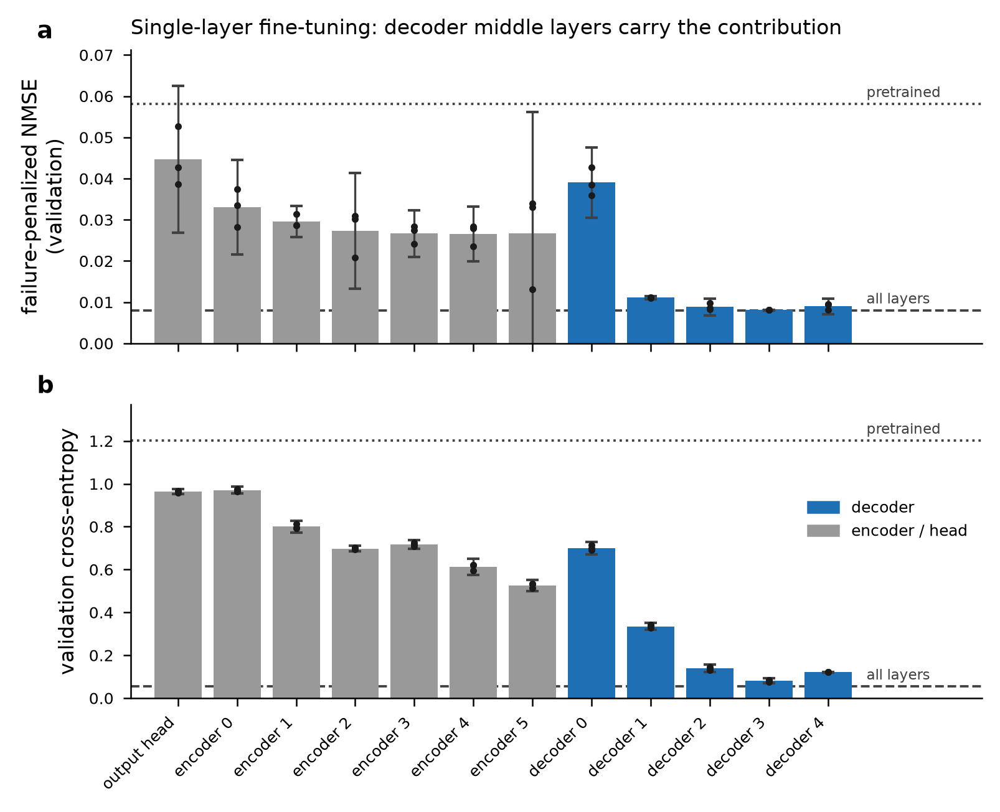

# LANSR研究：遺伝子制御ダイナミクスの発見に向けたニューラルシンボリック回帰の層別解析

> **現在地（2026年7月31日）**：CPU pilotに加え、Google Colab ProのNVIDIA L4で
> 3 seeds・noise 0.1のGPU_RUN1 reduced runをPhase 0–9まで完了した。
> 少数decoder層の数値性能は全層fine-tuningに近かったが、これは全network・統一budgetのpaper runではない。
> 確定結果と限界は [`results/GPU_RUN1_report.md`](results/GPU_RUN1_report.md) を参照する。

## 目次

- [1. 研究概要](#1-研究概要)
  - [1.1 研究目標](#11-研究目標)
- [2. 背景](#2-背景)
  - [2.1 GRNと遺伝子制御方程式](#21-grnと遺伝子制御方程式)
  - [2.2 シンボリック回帰](#22-シンボリック回帰)
  - [2.3 TransformerとNeSymReS](#23-transformerとnesymres)
  - [2.4 層選択的fine-tuning](#24-層選択的fine-tuning)
  - [2.5 TPSR](#25-tpsr)
  - [2.6 DREAM4とGeneNetWeaver](#26-dream4とgenenetweaver)
  - [2.7 関連研究と本研究の位置づけ](#27-関連研究と本研究の位置づけ)
- [3. 研究上の問い](#3-研究上の問い)
- [4. 用語解説](#4-用語解説)
- [5. 評価指標](#5-評価指標)
- [6. 実行環境と実装状況](#6-実行環境と実装状況)
- [7. 実施したPhase](#7-実施したphase)
- [8. GPU_RUN1を中心とした実験結果](#8-gpu_run1を中心とした実験結果)
- [9. GPU_RUN1とCPU pilotから得られた結論](#9-gpu_run1とcpu-pilotから得られた結論)
- [10. 結果を読む際の重要な注意](#10-結果を読む際の重要な注意)
- [11. 今後の展望](#11-今後の展望)
- [12. 再現方法](#12-再現方法)
- [13. リポジトリ構成](#13-リポジトリ構成)
- [14. 参考文献](#14-参考文献)

## 1. 研究概要

本研究は、遺伝子発現データから遺伝子制御ネットワーク（GRN）の動的方程式を求めるニューラルシンボリック回帰を対象に、
モデル内部のどの層が数式生成、変数選択、数値近似、式構造の回復を担うかを解析する研究である。
英語題目は次のとおりである。

> **Layer-wise Analysis of Neural Symbolic Regression for Discovering Gene Regulatory Dynamics**

### 1.1 研究目標

本研究の目標には、次の優先順位を置く。

1. **メイン目標：遺伝子制御ネットワークの動的方程式を求めるニューラルシンボリック回帰の層を解析する。**
   encoderとdecoderの各層について、表現probe、単一層fine-tuning、層ablation、寄与度、seed間順位安定性を測り、
   GRN動的方程式の生成に重要な層と、その役割を明らかにする。
2. **サブ目標1：シンボリック回帰としてのsymbolic recoveryの精度上昇。**
   NMSEだけでなく、exact recovery、skeleton recovery、symbolic equivalence、variable F1、valid rateを用い、
   数値的に近いだけの式ではなく、正しい変数と式構造を回復できる学習・探索方法を検討する。
3. **サブ目標2：遺伝子制御ネットワークの新たな方程式を発見する。**
   合成データで方法を検証した後、DREAM4とヒト時系列へ適用し、未知の制御関係を説明し得る候補方程式を提示する。
   ただし、holdoutでの再現、外挿安定性、特異点、既知生物学との整合性を検査するまでは、
   「真の方程式」や「因果機構」ではなく、検証対象となる候補方程式として扱う。

メイン目標はモデル内部の科学的理解、サブ目標1は方法性能の改善、サブ目標2は生物学的応用に対応する。
したがって、低い予測誤差だけで研究成功とは判定せず、層解析の再現性と式構造の回復を中心に評価する。

遺伝子 $i$ の発現量を $x_i(t)$ とすると、その時間変化を

```math
\frac{dx_i}{dt}=f_i(x_1,x_2,\ldots,x_p)
```

と表せる。本研究の目標は、未知の関数 $f_i$ を、ニューラルネットワーク内部の読めない計算としてではなく、
人間が読める数式として発見することである。

中心モデルには、事前学習済みTransformer型シンボリック回帰モデル **NeSymReS** を使う。
さらに、全パラメータを更新する代わりに、適応への寄与が大きい少数のTransformer層だけをfine-tuningする。
推論時には必要に応じて **TPSR** による木探索を加え、非ニューラル手法 **PySR** と比較する。

研究計画の詳細は [`docs/plans/20260714_firstplan.md`](docs/plans/20260714_firstplan.md)、GPU_RUN1の手順と実施記録は
[`GPU_RUN1/runbook.md`](GPU_RUN1/runbook.md) に記載している。実施済みGPU_RUN1の結果は
[`results/GPU_RUN1_report.md`](results/GPU_RUN1_report.md)、次の確認実験は
[`GPU_RUN2/plan.md`](GPU_RUN2/plan.md) にまとめている。

## 2. 背景

### 2.1 GRNと遺伝子制御方程式

**Gene Regulatory Network（GRN、遺伝子制御ネットワーク）** は、遺伝子や転写因子の制御関係を表すネットワークである。
例えば、遺伝子 $A$ が遺伝子 $B$ の発現を増やすなら $A\rightarrow B$、減らすなら $A\dashv B$ と表す。
GRNを知ることは、細胞が刺激に応答する仕組み、病気で制御が崩れる仕組み、薬の標的候補を理解する助けになる。

多くのGRN推定法は「辺があるか」や「重要度はいくつか」を出力する。しかし、辺だけでは、制御が直線的なのか、
ある濃度で飽和するのか、複数因子が協力するのかまでは分からない。本研究は一歩進んで、制御関数そのものを推定する。

合成データでは、生物学でよく使われる **Hill型制御**を主に扱った。活性化の例は

```math
\frac{dx_i}{dt}
=\frac{\alpha x_j^n}{K^n+x_j^n}-\beta x_i
```

である。第1項は遺伝子 $j$ による生成、第2項は遺伝子 $i$ の分解を表す。

- $\alpha$：最大生成速度
- $K$：反応が半分程度に達する発現量
- $n$：応答の急さを表すHill係数
- $\beta$：分解速度

抑制の例は

```math
\frac{dx_i}{dt}
=\frac{\alpha K^n}{K^n+x_j^n}-\beta x_i
```

である。$x_j$ が大きくなるほど第1項が小さくなるため、遺伝子 $j$ が遺伝子 $i$ を抑える。
このように式が得られれば、制御の向きだけでなく、飽和、協同性、分解の強さまで議論できる可能性がある。

実際の時系列データでは $dx/dt$ を直接観測できないため、隣接時点から有限差分で近似する。

```math
\left.\frac{dx}{dt}\right|_{t_k}
\approx \frac{x(t_{k+1})-x(t_k)}{t_{k+1}-t_k}
```

ただし、測定時点が少ない場合やノイズが大きい場合、この近似自体が大きな誤差源になる。

### 2.2 シンボリック回帰

通常の回帰は、直線や決められた形の式の係数を学習する。例えば線形回帰では

```math
\hat y=w_0+w_1x_1+w_2x_2
```

という形を人間が先に決め、 $w_0,w_1,w_2$ を求める。一方、 **シンボリック回帰（Symbolic Regression; SR）** は、
係数だけでなく、足し算、掛け算、割り算、べき乗、三角関数などの組合せも探索する。

データ集合を $`D=\{(\mathbf{x}_i,y_i)\}_{i=1}^{N}`$ 、使える数式の集合を $\mathcal{F}$ とすると、概念的には

```math
f^*=\underset{f\in\mathcal{F}}{\mathrm{arg\,min}}\left[\frac{1}{N}\sum_{i=1}^{N}\bigl(y_i-f(\mathbf{x}_i)\bigr)^2+\lambda C(f)\right]
```

を解く。 $C(f)$ は式の長さや演算子数などの複雑度、
$\lambda$ は「精度」と「単純さ」のどちらを重視するかを決める値である。
単に誤差が小さいだけの巨大な式ではなく、短く説明しやすい式を探す点が重要である。

本研究の比較対象 **PySR** は、複数の式集団を進化させ、式の変形・簡約・定数最適化を繰り返す実用的なSRである [4]。

### 2.3 TransformerとNeSymReS

**Transformer**は、入力中のどの部分に注目するかを計算するattentionを中心としたニューラルネットワークである。
入力行列を $Q,K,V$ に変換するscaled dot-product attentionは、概略

```math
\mathrm{Attention}(Q,K,V)=\mathrm{softmax}\!\left(\frac{QK^{\mathsf T}}{\sqrt{d_k}}\right)V
```

で表される。Transformerは同じ形の層を複数積み重ねる。**encoder**は入力を内部表現へ変換し、
**decoder**はその表現から出力列を1記号ずつ生成する。

**NeSymReS** は、大量の人工数式と、その数式から作った数値点集合を使ってTransformerを事前学習する手法である [1]。
入力は順序を持たない点集合

```math
\{(\mathbf{x}_1,y_1),\ldots,(\mathbf{x}_N,y_N)\}
```

で、出力は数式を表すtoken列である。新しい問題を毎回ゼロから探索するのではなく、事前学習で得た
「よく現れる数式の形」をprior（事前知識）として使える点が特徴である。

NeSymReS論文は、大規模な手続き生成データによる事前学習がSRに利用できることを示した。
一方、事前学習分布と生物学的なGRN式の間にはずれがある。本研究は、そのずれを少数層のfine-tuningで埋められるかを調べる。

### 2.4 層選択的fine-tuning

**fine-tuning（微調整）** は、事前学習済みモデルを目的データでもう一度学習し、専門分野へ適応させることである。
全層fine-tuningは柔軟だが、計算・メモリを多く使い、データが少ないと過適合する可能性がある。

本研究の直接の着想は、Zhangらの *Is One Layer Enough?* [3] である。この研究はLLMの強化学習後学習を
層ごとに調べ、改善が少数の中間層へ集中する場合を報告した。層 $l$ だけを学習した損失を $L_l$、
事前学習モデルを $L_{\mathrm{base}}$、全層学習を $L_{\mathrm{full}}$ とすると、損失が小さいほどよい場合の層寄与度を

```math
C_l=
\frac{L_{\mathrm{base}}-L_l}
{L_{\mathrm{base}}-L_{\mathrm{full}}}
```

のように表せる。 $C_l=1$ なら、その1層だけで全層学習と同程度の改善を回復したことになる。

ただし先行研究の対象はLLM・強化学習であり、NeSymReS・教師あり学習・GRNにはそのまま当てはまらない。
本研究は、この考えを別分野へ移し、どの層が数式生成や数値精度に寄与するかを検証する。

### 2.5 TPSR

**TPSR（Transformer-based Planning for Symbolic Regression）** は、Transformerの出力確率と
**Monte Carlo Tree Search（MCTS）** を組み合わせる方法である [2]。通常のbeam searchは、次のtoken確率が高い候補を
残していく。TPSRは数式を途中まで作った状態から先読みし、完成した式の精度や複雑度を評価して探索方向を修正する。

本研究ではTPSRを別の学習モデルではなく、NeSymReSの数式生成を改善する推論時探索として扱う。
概念的な報酬は、例えば

```math
R(f)=-\mathrm{NMSE}(f)-\lambda C(f)
```

と書ける。予測誤差が小さく、式も単純なほど報酬が高い。微分できない評価値を探索へ直接組み込めることが利点である。

### 2.6 DREAM4とGeneNetWeaver

**DREAM4 In Silico Network Challenge** は、未知のGRNを遺伝子発現データから復元する国際的な比較課題である [6]。
本研究で使うin silicoデータには、10遺伝子または100遺伝子のネットワーク、時系列、摂動実験、正解の制御辺が含まれる。

データ生成には **GeneNetWeaver（GNW）** が使われた [5]。GNWは実在する大腸菌・酵母ネットワークから部分構造を取り出し、
転写・翻訳、制御、分子ノイズ、実験ノイズを含む動力学モデルを与える。したがって、単純なランダムグラフより
生物学的な構造を持ちつつ、正解ネットワークを知った状態で評価できる。

DREAM4が重要なのは、合成Hill式だけで成功した方法が、より複雑でノイズのある条件でも動くかを調べられるからである。
ただし、本研究で主に利用した公開時系列から得られるのは発現量であり、真の $dx/dt$ ではない。
そのため、有限差分誤差と候補制御因子選択の誤りがSRより前に入る。

### 2.7 関連研究と本研究の位置づけ

- **NeSymReS** はTransformerの大規模事前学習をSRへ導入した [1]。
- **TPSR** はMCTSでTransformerの数式生成を計画問題として改善した [2]。
- **PySR** は進化的探索による強力な非ニューラル比較対象である [4]。
- **ScaleSR** は多変数SRを低次元問題へ分解し、toggle switchやrepressilatorも扱った [7]。
- **LNSR**、**PI-NDSR**、**ND2**、**ODEFormer** は、ニューラルSRをネットワーク動力学やODE発見へ拡張している
  [9–12]。本研究は、それらの予測性能だけでなくTransformer内部の層ごとの役割を主対象にする。
- **TSRM**、**DecoderLens**、**CKA**、probeとactivation patchingの研究は、層表現と因果的寄与を区別して
  解釈する方法を与える [8, 14–19]。
- **SINDy**、**SINDy-PI**、**WeakIdent**、**D-CODE** は、観測軌道から支配方程式を回復する別系統の方法であり、
  導関数推定と疎な式回復の比較基準になる [22, 23, 26, 31]。
- **SRBench**、**Boolformer**、**ESRT**、**CNSR**、**DySymNet**、**DGSR**などは、
  探索方式、制約、生成モデルの異なるSR比較対象を提供する [20, 21, 27, 28, 32, 35]。

本研究の新規性は個々の技術そのものではなく、次の組合せにある。

1. GRN動的方程式を求めるニューラルSRのencoder/decoder層を、性能順位だけでなくprobe、ablation、
   表現類似度、層介入によって解析する。
2. 層解析の知見を使ってsymbolic recoveryを改善し、全層・ランダム層・非ニューラルSRと公平に比較する。
3. 合成GRNで検証した方法をDREAM4とヒト時系列へ段階的に適用し、新しい候補方程式を失敗例とともに残す。

## 3. 研究上の問い

1. GRN動的方程式の入力表現、変数選択、token生成、式構造回復は、NeSymReSのどの層に担われるか。
2. 層の表現probe、fine-tuning、ablation、activation介入は同じ重要層を示し、その順位はseedやGRNを越えて安定するか。
3. 高寄与層だけのfine-tuningは、全層・ランダム層・低寄与層より効率的で、symbolic recoveryも改善するか。
4. 選択的fine-tuning、演算子制約、探索方法は、NMSEだけでなくexact/skeleton recoveryと安全性を改善するか。
5. 合成GRNで得た層解析と方法改善は、DREAM4やヒト時系列へ転移し、新しい候補方程式の発見につながるか。
6. NeSymReS、TPSR、PySR、疎な方程式発見法は、同じ演算子・時間budgetの下でどの条件に強いか。

## 4. 用語解説

| 用語 | 高校生向けの説明 |
|---|---|
| **Attention** | 入力の各部分について「今の出力を作るとき、どこをどれだけ重視するか」を計算する仕組み。 |
| **Beam search** | 途中まで作った候補を複数残し、良さそうな候補を枝分かれさせながら完成形を探す方法。 |
| **BFGS / Broyden–Fletcher–Goldfarb–Shanno algorithm** | 数式に含まれる数値定数を、誤差が小さくなるように調整する最適化アルゴリズム。4人の研究者の姓に由来する。 |
| **Best weight / Best checkpoint** | validationで最も良い成績だった時点のモデルの重み。学習の最終時点が最良とは限らないため保存・復元する。 |
| **CE / Cross-Entropy** | 正解tokenに高い確率を付けられたかを測る学習誤差。小さいほどよい。 |
| **Checkpoint** | 学習済みモデルの重みを保存したファイル。ゲームのセーブデータに近い。 |
| **CPU / Central Processing Unit** | コンピュータ全体の汎用的な計算を担当する中央処理装置。 |
| **CUDA / Compute Unified Device Architecture** | NVIDIAが提供する、GPUで汎用計算を行うための並列計算基盤。本研究のGPU実験で使用する。 |
| **Decoder** | Transformerのうち、数式tokenを順番に出力する側。 |
| **Domain shift** | 学習データと本番データの性質が異なること。合成式と実際の生物データの差など。 |
| **DREAM4 / Dialogue for Reverse Engineering Assessments and Methods 4** | 正解ネットワーク付きの人工遺伝子発現データを使うGRN推定ベンチマーク。 |
| **E2E / End-to-End** | 入力から最終出力までを、一つのつながった処理として実行または学習すること。 |
| **Early stopping** | validationの成績が改善しなくなったら学習を早めに止め、過適合を抑える方法。 |
| **Encoder** | Transformerのうち、入力された数値点集合を内部表現へ変換する側。 |
| **Fail-fast** | 必須条件が崩れたとき、古い設定などで処理を続けず、その場で明確なエラーとして停止する設計。 |
| **FD / Finite Difference** | 隣り合う時点の値の差から変化率を近似する方法。有限差分。 |
| **FT / Fine-Tuning** | 既に学習したモデルを、目的に合う少量のデータで追加学習すること。 |
| **Generalization** | 学習に使っていないデータでも正しく働くこと。汎化。 |
| **GEO / Gene Expression Omnibus** | 公開遺伝子発現データベース。本研究ではGSE112372を利用した。 |
| **GNW / GeneNetWeaver** | DREAM系の人工GRNと発現データを生成するソフトウェア。 |
| **GPU / Graphics Processing Unit** | 大量の行列計算を並列処理する画像処理装置。深層学習をCPUより高速に実行できる。 |
| **GRN / Gene Regulatory Network** | 遺伝子同士の活性化・抑制関係を表すネットワーク。 |
| **GSE / GEO Series** | GEOに登録された一つの研究・データシリーズを表すaccessionの接頭辞。`GSE112372`はその登録番号。 |
| **Hill式** | 遺伝子制御の飽和やスイッチらしい応答を表す代表的な数式。 |
| **Hyperparameter** | 学習率やepoch数など、モデルがデータから覚えるのではなく実験者が候補を決める設定。ハイパーパラメータ。 |
| **ID / In-Distribution、OOD / Out-of-Distribution** | IDは学習時に近い分布、OODは学習時の分布から外れた条件での評価。 |
| **LASSO / Least Absolute Shrinkage and Selection Operator** | 不要な変数の係数を0へ近づけ、重要な変数を選びやすくする回帰手法。 |
| **LLM / Large Language Model** | 大量の文章で学習した大規模言語モデル。層選択学習の先行研究で使われた。 |
| **LODO / Leave-One-Donor-Out** | 1人分をテストに回し、残りの人で学習する操作を全員分繰り返す評価。 |
| **LPS / Lipopolysaccharide** | グラム陰性菌の外膜成分。免疫反応を起こす刺激としてヒト時系列実験に使われた。 |
| **LANSR / Layer-wise Analysis of Neural Symbolic Regression** | 遺伝子制御ダイナミクスの発見に向け、ニューラルシンボリック回帰モデルを層別に解析する本研究の略称。 |
| **MCTS / Monte Carlo Tree Search** | 試しの先読みを繰り返して有望な枝を探す木探索。 |
| **MI / Mutual Information** | 二つの変数がどの程度情報を共有しているかを測る量。候補制御因子の選択に使う。 |
| **Motif** | GRNに繰り返し現れる小さな接続パターン。toggleやrepressilatorなど。 |
| **NCBI / National Center for Biotechnology Information** | GEOなどの生命科学データベースを運営する米国の国立機関。 |
| **NeSymReS / Neural Symbolic Regression that Scales** | 数値点集合から数式を生成する、事前学習済みTransformer型SR。 |
| **NMSE / Normalized Mean Squared Error** | 平均二乗誤差をデータのばらつきで正規化した指標。0に近いほどよい。 |
| **NSRS / Neural Symbolic Regression that Scales** | 本リポジトリでNeSymReS参照実装を置いているディレクトリ名。 |
| **ODE / Ordinary Differential Equation** | 常微分方程式。時間変化を記述する方程式。 |
| **Oracle** | 本来は未知の正解情報を与えた理想条件。手法の上限やボトルネックを調べるために使う。 |
| **Overfitting** | 学習データには合うが、未知データでは悪くなること。過適合。 |
| **Prior** | 探索前から持つ知識や傾向。既知の制御関係や、事前学習で得た式の出やすさなど。 |
| **PySR / Python用Symbolic Regressionライブラリ** | 進化計算で数式を探索するライブラリ。PySRは製品名であり、本研究ではNeSymReSとの主要比較対象。 |
| **R² / Coefficient of Determination** | 決定係数。予測がデータの変動をどれだけ説明できたかを表し、1に近いほどよい。 |
| **Regulator** | 標的遺伝子の発現に影響を与える遺伝子・転写因子。制御因子。 |
| **Repressilator** | 3遺伝子が環状に抑制し合う人工遺伝子回路。振動を起こし得る。 |
| **RL / Reinforcement Learning** | 試行錯誤と報酬を通じて行動方針を学ぶ強化学習。層選択学習の先行研究で使われた。 |
| **RNA / Ribonucleic Acid** | DNAの情報をもとに作られ、遺伝子発現の測定対象になるリボ核酸。 |
| **Seed** | 乱数の初期値。同じseedなら同じランダム処理を再現しやすい。 |
| **SBML / Systems Biology Markup Language** | 生物学的モデルを機械可読な形で交換するための標準形式。 |
| **SHA-256 / Secure Hash Algorithm 256-bit** | ファイル内容から固定長の識別値を作る方式。checkpointが同一か確認するために使う。 |
| **Symbolic recovery** | 予測値だけでなく、正解と同じ数式構造を回復できたかという評価。 |
| **SR / Symbolic Regression** | データを説明する、人間が読める数式そのものを探索する回帰。 |
| **TF / Transcription Factor** | DNAの転写を促進または抑制し、遺伝子発現を制御する転写因子。 |
| **Token** | 数式をモデルが扱える小単位へ分けたもの。変数、演算子、括弧など。 |
| **TP / True Positive、FP / False Positive、FN / False Negative** | TPは正しく検出したもの、FPは誤検出、FNは見逃し。Precision・Recall・F1の計算に使う。 |
| **TPSR / Transformer-based Planning for Symbolic Regression** | Transformerの候補確率を使い、MCTSで数式を先読み探索する手法。 |
| **Transformer** | Attentionを中心に、多層のencoder/decoderで情報を処理するニューラルネットワーク。 |
| **Validation / Test** | validationは方法や設定の選択用、testは最後の性能確認用。testで方法を選ぶと評価が甘くなる。 |
| **Variable F1 / Variable-recovery F1 Score** | 真の式に必要な変数を、予測式がどの程度過不足なく含むかを測るF1指標。 |

## 5. 評価指標

真値を $y_i$ 、予測を $\hat y_i$ 、真値の平均を $\bar y$ とする。

### NMSE

```math
\mathrm{NMSE}=\frac{\sum_{i=1}^{N}(y_i-\hat y_i)^2}{\sum_{i=1}^{N}(y_i-\bar y)^2+\varepsilon}
```

0が完全一致で、小さいほどよい。1付近は「平均値だけを予測する」のと同程度である。

### 決定係数 $R^2$

```math
R^2=1-\frac{\sum_{i=1}^{N}(y_i-\hat y_i)^2}{\sum_{i=1}^{N}(y_i-\bar y)^2+\varepsilon}
```

1が完全一致、0は平均値予測と同程度、負値は平均値予測より悪い。

### Precision・Recall・F1

```math
\mathrm{Precision}=\frac{TP}{TP+FP},\qquad\mathrm{Recall}=\frac{TP}{TP+FN}
```

```math
F_1=\frac{2\,\mathrm{Precision}\,\mathrm{Recall}}{\mathrm{Precision}+\mathrm{Recall}}
```

制御辺や使用変数の回復を測る。Precisionは余計な予測の少なさ、Recallは見落としの少なさを表す。

### 式回復と複雑度

- **exact recovery**：文字列または簡約後の式が正解と一致するか。
- **skeleton recovery**：数値定数を一般定数に置き換えた式構造が一致するか。
- **complexity**：演算子・変数・定数などのノード数。小さいほど単純である。
- **valid rate**：生成した式のうち、構文解析と数値評価に成功した割合。

最新コードではdecode失敗を除外せず、失敗へ罰則を与えたNMSEを主指標にする。

## 6. 実行環境と実装状況

CPU実験はWindows上のPython 3.10環境で実施した。高beam幅、十分なMCTS rollout、大規模なseed反復は未実施である。

| 項目 | 状況 |
|---|---|
| Python | 3.10.20 |
| PyTorch | 2.5.1+cpu |
| NeSymReS | checkpointロード・推論・選択的fine-tuningに成功 |
| PySR | Juliaバックエンドを含め動作確認済み |
| TPSR | E2EおよびNeSymReSバックボーン用コードを統合 |
| CPU pilot当時のテスト | **46 passed、2 skipped** |
| GPU_RUN1 | Colab Pro、NVIDIA L4、Python 3.10.13でreduced run完了 |

CPU pilot当時の2件のskipは、Python 3.12環境ではNeSymReS/Hydra 1.0の互換テストを実行しないことと、
gitignore対象のDREAM4 archiveが未配置の環境では実データ統合テストを実行しないことによる。
GPU本実験ではPython 3.10を使用する。ColabではUIを動かす標準kernelと研究コードの実行環境を分け、
Phase 0 Notebookが用意する明示的なPython 3.10 workerでpreflightと全Phaseを実行する。

ローカルの `10M.ckpt` はファイル名と異なり、state dict上はencoder/decoder各5層の100M設定側アーキテクチャである。
そのため `assets/nesymres/jupyter/100M/config.yaml` と組み合わせている。

GPU_RUN1は3 seeds、noise 0.1、主にbeam 2で実行した。Phase 7は計算制約により主集計をDREAM4 networks 1–3へ縮小し、
Phase 8のPySRだけはローカルCPUで実行してColab成果物へ統合した。

## 7. 実施したPhase

| Phase | 内容 | GPU_RUN1での到達点 |
|---|---|---|
| 0 | 環境・checkpoint・ベースラインの動作確認 | Colab、Drive、Python 3.10、L4 preflight完了 |
| 1 | 合成Hill式・toggle・repressilator・多様な式構造の生成 | noise 0.1で完了 |
| 2 | NeSymReSとPySRの基礎比較 | reduced設定で完了 |
| 3 | encoder/decoder各層の選択的fine-tuningスキャン | 約10分で完了 |
| 4 | 層寄与度とseed安定性の測定 | 3 seedsで完了 |
| 5 | top/middle/random/bottom/full fine-tuningの比較 | 3 seedsで完了 |
| 6 | 選択的FT × TPSRの2×2比較 | noise 0.1、3 seedsで完了 |
| 7 | DREAM4 Size10/Size100への転移 | 主集計は3 seeds × networks 1–3 |
| 8 | ヒトLPS刺激時系列、LODO評価 | NeSymReS 3 seedsとローカルPySRを統合 |
| 9 | validation、archive、checksum | validated、archive作成済み |

## 8. GPU_RUN1を中心とした実験結果

### 8.1 GPU_RUN1の位置付けと実行範囲

GPU_RUN1は、Google Colab ProのNVIDIA L4とローカルCPUを使い、3 seeds・noise 0.1でPhase 0–9を実行した
現時点で最も重要な実験である。最終run `colab_reduced_20260729_03` はmanifestが `complete`、
validationが `validated` であり、全問題の推定式と失敗理由も保存した。

ただし、これは探索的なreduced runである。単一commit・全DREAM4 network・統一計算budgetのpaper runではなく、
Phase 7の主集計は全条件が揃ったnetworks 1–3に限る。以下の `±` は、特記しない限り3 seedsに対する
Studentのt分布による95%信頼区間の半幅である。

### 8.2 Phase 4：寄与の大きい層はdecoder中後段へ集中した

合成validationでは、`decoder_2`、`decoder_3`、`decoder_4`がCE、NMSE、$`R^2`$、
skeleton recoveryのtop 3へ全seedで入った。代表的な`decoder_3`の結果は次のとおりである。

| 指標 | pretrained | `decoder_3`のみFT | 全層FT |
|---|---:|---:|---:|
| CE | 1.2015 | 0.0815 | **0.0545** |
| Penalized NMSE | 0.0581 | 0.0081 | **0.0080** |
| Penalized $`R^2`$ | 0.9305 | 0.9900 | **0.9901** |
| Variable F1 | 0.9676 | 0.9722 | **1.0000** |
| Skeleton recovery rate | 0.0000 | 0.5278 | **0.6528** |

`decoder_3`単独の正規化寄与度はNMSEで`0.9984 ± 0.0068`、$`R^2`$で`0.9979 ± 0.0059`だった。
seed間の順位相関もNMSEのSpearmanで0.883、Kendallで0.758と正であり、層別信号は再現した。



### 8.3 Phase 5：少数層FTは全層FTへ数値的に近かった

未知のtest問題に対するfailure-penalized NMSEは次のとおりだった。

| 条件 | Penalized NMSE | Valid rate | 式複雑度 |
|---|---:|---:|---:|
| pretrained | 0.0935 ± 0.0150 | 0.989 | 18.346 |
| 全層FT | **0.0142 ± 0.0037** | 1.000 | 20.156 |
| top 1 | 0.0146 ± 0.0009 | 1.000 | — |
| top 2 | 0.0156 ± 0.0084 | 1.000 | — |
| top 3 | 0.0150 ± 0.0060 | 1.000 | — |
| middle 3 | 0.0161 ± 0.0079 | 1.000 | — |
| random 3集合のseed内平均 | 約0.0174 | 1.000 | — |
| bottom 3 | 0.0246 ± 0.0084 | 0.967 | — |

top 3と全層FTのpaired差は`+0.0009`、95%信頼区間は`[-0.0055, +0.0072]`で、実測上は近かった。
一方、事前設定した同等性margin `±0.05`は、全層FTによる改善量約0.079の63%に相当して広すぎたため、
このrunだけから厳密な同等性が確立したとはしない。

top 3はbottom 3より良かったが、random 3集合との差は`-0.0024`で、95%信頼区間
`[-0.0061, +0.0013]`は0を含んだ。したがって、少数層FTの有効性は示されたが、
**寄与度上位層を選ぶ必要性という中心仮説は未支持** である。
top 1のpeak memoryは全層FTの620.4 MBに対して257.8 MBで約58%少なく、記録elapsedも約12%短かった。

### 8.4 Symbolic recovery：IDでは層別信号があり、未知骨格testでは0だった

GPU_RUN1のsymbolic recoveryを一律に「全条件0」とするのは正確ではない。
validationでは、skeleton recovery rateが全層FTで0.653、`decoder_3`で0.528、pretrainedで0だった。
一方、exact recoveryとsymbolic equivalenceはvalidationでも全条件0だった。

さらに、validationはtrainと式骨格が重なるin-distribution評価だったのに対し、testの60問題は
`hill_act_n4`、`hill_rep_n3`、`product_hill`、`ratio_xy`、`sum_linear3`という
学習時にない5種類の式骨格だけで構成されていた。このtestでは全条件のskeleton recoveryが0だった。
つまり、fine-tuningは既知骨格の回復を改善したが、未知の式族への構造的外挿には成功していない。

なお、定数の吸収や因数分解の違いで同値式が不一致になる例もあり、0の一部は評価器の限界を含む。
それでもexact recoveryとsymbolic equivalenceが得られていないため、低NMSEを真の遺伝子制御式の回復とは解釈しない。

### 8.5 Phase 6：選択的FTは高価なTPSR探索の必要性を小さくした

| Fine-tuning | 探索 | Penalized NMSE | Valid rate | 式複雑度 | 記録elapsed |
|---|---|---:|---:|---:|---:|
| なし | beam | 0.0811 ± 0.0205 | 1.000 | 18.200 | 2.6分 |
| なし | TPSR | 0.0575 ± 0.0049 | 0.983 | 21.060 | 117.7分 |
| 選択的FT | beam | 0.0131 ± 0.0039 | 1.000 | 19.622 | 2.1分 |
| 選択的FT | TPSR | **0.0096 ± 0.0010** | 0.921 | 25.963 | 116.5分 |

TPSRはpretrainedではNMSEを0.0237改善したが、選択的FT後の追加改善は0.0035に縮小し、
その95%信頼区間は0を含んだ。`選択的FT + beam`は`pretrained + TPSR`より低NMSEであり、
所要時間も約55分の1だった。GPU_RUN1のbudgetでは、層選択的FTの方が高価なdecode探索より
費用対効果が高く、TPSR追加時はvalid rateと式複雑度も悪化した。

### 8.6 Phase 7：DREAM4転移はoracle変数でも低性能だった

DREAM4の主集計は3 seeds × networks 1–3である。

| Network size | 条件 | Penalized NMSE | Valid rate | Selector edge F1 |
|---|---|---:|---:|---:|
| 10 | pretrained + oracle | 0.9207 ± 0.0947 | 0.978 | 0.848 |
| 10 | selective + correlation | 0.8903 ± 0.0391 | 0.789 | 0.327 |
| 10 | selective + oracle | **0.8554 ± 0.1004** | 0.933 | 0.848 |
| 100 | pretrained + oracle | 0.9426 ± 0.0152 | 0.999 | 0.848 |
| 100 | selective + correlation | 0.9005 ± 0.0082 | 0.873 | 0.047 |
| 100 | selective + oracle | **0.8794 ± 0.0358** | 0.908 | 0.848 |

Size100のcorrelation、LASSO、mutual informationのedge F1は約0.05で、regulator selectionは明確な課題だった。
しかし、真のregulatorを与えるoracle条件でもNMSEは0.855–0.879で、平均値予測のNMSE=1をわずかに下回る程度である。
したがって、selectorだけが支配的な原因なのではなく、5時点からの有限差分、データ不足、
合成データとDREAM4のdomain shift、数式生成の失敗も含む複合的な転移問題である。

現段階ではDREAM4への転移成功は示されていない。また、有限差分ターゲットは真のODE微分ではない。

### 8.7 Phase 8–9：ヒトLODO、式の安全性、provenance

GSE112372の20遺伝子・4 donors・5時点を用いたLODO評価は次のとおりだった。

| 方法 | In-donor NMSE | Holdout NMSE | Generalization gap | Valid rate |
|---|---:|---:|---:|---:|
| pretrained beam | 0.6241 ± 0.1411 | 0.8867 ± 0.1637 | 0.2626 ± 0.0375 | 0.992 |
| selective beam | 0.2378 ± 0.1134 | 0.5145 ± 0.1927 | 0.2767 ± 0.2968 | 1.000 |
| PySR | **0.0110 ± 0.0030** | **0.2417 ± 0.1916** | 0.2307 ± 0.1886 | 0.958 |

selective FTはpretrained NeSymReSを改善した。PySRの平均holdout NMSEはさらに低かったが、
donor 11ではPySRが0.729、selective beamが0.579と順位が逆転した。加えてPySRとNeSymReSでは
探索時間、候補評価回数、演算子集合、GPU使用条件が統一されていない。4 donorsだけの結果から
方法間の一般的な優劣は決められない。

保存式には`tan`、危険な除算、特異点に近い形が含まれた。5時点の平滑化有限差分は真のODE微分ではないため、
これらは因果機構や真のヒト制御ODEではなく、追加検証が必要な候補式である。

Phase 9ではmanifestを `complete`、validationを `validated` とし、82 JSON、312 groups、6,831 recordsを検査した。
式スキーマ、ログ、checkpoint hash、archive SHA256を保存している。詳細な実行履歴と全数値は
[`GPU_RUN1_report.md`](results/GPU_RUN1_report.md)、結果の再解釈と追加解析は
[`GPU_RUN1_reanalysis_report.md`](results/GPU_RUN1_reanalysis_report.md)を参照する。

### 8.8 CPU pilotの要約

GPU_RUN1以前のCPU pilotは、Phase 0–8のパイプライン構築と問題発見に使ったlegacy resultである。
主な役割は、NeSymReS・PySR・TPSRの実行確認、合成GRN生成、層スキャン、DREAM4・ヒト時系列への
適用経路を一通り成立させたことにある。

CPU pilotでは単一seedのPhase 5でtop 2のNMSEが0.0167、全層FTが0.2818となったが、
条件別hyperparameter探索や最新のvalidation/test分離より前の結果であり、仮説の確証には使わない。
Phase 6も2問題だけのsmoke testである。旧runの一部には問題単位の推定式が保存されていないため、
GPU_RUN1の式を遡ってCPU結果として扱うこともしない。

CPU pilotの詳細は[`CPU_RUN/README.md`](CPU_RUN/README.md)と
[`results/phase_results/`](results/phase_results/)に残し、本READMEの主結果とは混ぜない。

## 9. GPU_RUN1とCPU pilotから得られた結論

1. **適応効果はdecoder中後段へ集中した。** GPU_RUN1では`decoder_2`〜`decoder_4`の順位が3 seedsで安定した。
2. **少数層FTは全層FTへ数値的に近かった。** ただし事前設定した同等性marginは広すぎ、厳密な同等性の確立には再検証が必要である。
3. **精密な層rankingの必要性は未確定である。** Top 3対random 3の差は3 seedsでは明確でなく、中心仮説は未支持だった。
4. **選択的FTは高価なTPSR探索より費用対効果が高かった。** FT後のTPSR追加改善は小さく、時間、valid rate、複雑度が悪化した。
5. **DREAM4転移には複数のボトルネックがある。** 経験的selector F1は低いが、oracle変数でもNMSEが高く、
   有限差分、データ不足、domain shift、数式生成も解決していない。
6. **ヒトLODOではPySRが低NMSEだった。** ただし方法間budgetが不統一で、NeSymReSへの一般的優越を確定していない。
7. **未知骨格のsymbolic recoveryは未達である。** ID validationでは層別信号があったが、未知骨格testでは全条件0だった。
8. **GPU_RUN1は探索的reduced runである。** Phase 7はnetworks 1–3で、複数の継続runを含むため、
   GPU_RUN2を固定commitの独立な確認実験とする。

## 10. 結果を読む際の重要な注意

8.1〜8.7はGPU_RUN1の結果であり、CPU pilotは8.8だけに要約した。
8.8のCPU数値には最新のレビュー修正より前に生成されたlegacy pilotが含まれ、Phase 4以降は
次の修正後に同じ条件で再実行した値ではない。

- testを層選択へ使わず、trainからmotif単位でvalidationを分離する。
- Phase 5の最終比較に独立testだけを使う。
- seed内で乱数状態とバッチ順を固定し、条件間をpaired comparisonにする。
- 少数標本の95%信頼区間にStudentのt分布を使う。
- DREAM4を有限差分後の行ではなく、有限差分前のtrajectory単位で分割する。
- decode失敗を除外せず、valid率とfailure-penalized NMSEを主指標にする。
- Phase 6で精度・valid率・式複雑度を同時保存する。
- runごとのmanifest、checkpoint SHA256、ログ、出力を分離する。

### 10.1 GPU_RUN1へ追加した公正化・安全対策

Claudeの研究レビューで、CPU pilotのfull FTがpretrainedより悪化しているため、同じ学習率とepochを全条件へ
適用した結果だけでは「少数層で十分」と判断できないことが指摘された。これを受け、GPU用の最新コードには次を実装した。

- **同数候補によるvalidation探索**：top、random、bottom、fullなど、すべてのtrainable条件へ同じ
  学習率×epoch候補数を与える。各候補は同じseed、初期checkpoint、データ順で比較する。
- **early stoppingとbest-weight復元**：validation CEが改善しなくなったら学習を停止できる。
  停止しない設定でも、指定epochの最後ではなくvalidation CEが最良だったepochの重みを復元する。
- **testの隔離**：学習率、epoch、停止時点はvalidationだけで選び、選択済みモデルだけを独立testで一度評価する。
- **探索履歴の保存**：候補数、各候補の設定とvalidation CE、選ばれた学習率・epoch、best epoch、stop epochをJSONへ保存する。
- **full FT基準の検査**：full FTがpretrainedを全seedで改善した指標だけ、full FTを分母とする正規化寄与度を使う。
- **絶対改善量による順位fallback**：基準が成立しない指標は捨てず、validation上のpretrainedからの絶対改善量で順位を作る。
  これは旧CPU順位へのfallbackではなく、同じGPU runのデータだけを使う事前規定の切替である。
- **指標の混入防止**：未定義のNMSEや$R^2$寄与度を順位平均へ混ぜない。Phase 5の結果には、CE、NMSE、$R^2$のうち
  実際に層順位へ使えた指標名も記録する。
- **順位安定性**：top-3出現率に加え、seed間のSpearman・Kendall順位相関を保存する。
- **複数random対照**：複数のrandom層集合を各training seedで評価し、seed内平均をtop条件とpaired比較する。
  GPU_RUN1では3集合を使ったが検出力が不足したため、GPU_RUN2では反復数を事前に増やす。
- **条件間の直接比較**：top 1/2/3とpretrained、middle、bottom、複数random集合、full FTについて、NMSE、R2、valid率、式複雑度のpaired差を保存する。
  top対fullではfailure-penalized NMSE差・95% t区間を主判定に使う。
  事前指定margin（既定0.05）に区間全体が入る場合だけ「実質同等」とし、単なる非有意差を同等と解釈しない。
- **fail-fast**：正規化寄与度と絶対改善量のどちらからも有効なPhase 4順位を作れない場合、古いCPU pilotの固定順位へ戻らず停止する。

Phase 4のGPU runでは、通常の寄与度に加えて次を保存する。

```text
phase4_multiseed/
  raw_scores_seed*.json                    正規化前のbase/full/各層スコア
  absolute_improvements_seed*.json         pretrainedからの絶対改善量
  contribution_status_seed*.json           seedごとのfull FT基準の成否
  contribution_status_aggregate.json       全seedをまとめた基準成立数
  tuning_seed*.json                        候補設定とvalidation選択履歴
  contrib_aggregate.json                    条件を満たした正規化寄与度
  absolute_improvements_aggregate.json      絶対改善量のseed集約
  layer_ranking_scores.json                 後続Phaseが使うlive順位スコア
  layer_ranking_metadata.json               指標ごとの正規化／絶対改善量の選択根拠
  layer_rankings.json                        accuracy統合順位、CE順位、使用指標
  layer_importance_evidence.json             95%区間が0を超える改善層と「改善層なし」の判定材料
  ranking_stability.json                     seed間Spearman・Kendall順位相関
```

これらはGPU実験の設計を修正したものであり、8.1〜8.7のCPU pilotを再計算した結果ではない。
したがって、CPU pilotの数値を新しい設計で得た結果として解釈してはならない。

また、旧Phase 3–6では集約ファイルに推定式文字列を残していなかった。数値指標だけでは式の妥当性を監査できないため、
GPU_RUN1では各問題について、真の式、推定式、簡約式、変数対応、複雑度、valid判定を保存した。

したがって、CPU結果だけから論文レベルで仮説を確定してはならない。
GPU_RUN1では少数層FTの全層同等性が支持されたが、3 seedsのreduced runであり、独立な確認実験が必要である。
現時点の適切な表現は次のとおりである。

> 層選択的fine-tuning、TPSR、DREAM4、ヒトLODOを含む研究パイプラインを構築した。
> GPU_RUN1 reduced runでは少数decoder層が全層FTに匹敵する数値性能を示した一方、
> 構造回復、高次元変数選択、公平なbaseline比較が未解決として残った。

## 11. 今後の展望

### 11.1 次に行うGPU_RUN2

GPU_RUN2の詳細は [`GPU_RUN2/plan.md`](GPU_RUN2/plan.md) に記載する。
主要な変更は次のとおりである。

1. **固定commitの独立run**：GPU_RUN1の継続成果物をseed反復として混ぜず、Phase 0–9を一貫した設定で実行する。
2. **validation probing**：全層を高budgetで走らせる前に候補を5〜8層へ絞り、testを見る前にrankingを固定する。
3. **演算子制限**：`tan`などの三角関数と危険な除算を主探索から除き、NeSymReS、TPSR、PySRのoperatorをそろえる。
4. **15秒timeout**：validation probeで妥当性を確認してから全条件へ固定し、p50、p90、p95、最大時間、timeout率を保存する。
5. **top対randomの確認**：random層集合の反復を増やし、全層同等性とは別にrankingの付加価値を検証する。
6. **TPSRのGo/No-Go**：MCTS、BFGS、Transformer推論をprofileし、費用対効果が低ければ大規模実行しない。
7. **DREAM4全network**：Size10/100、networks 1–5を同じbudgetで完了し、regulator selectionとSR誤差を分解する。
8. **CPU/GPU分離**：PySR、集計、図表、archiveなどCPU中心処理をローカルへ移す。
9. **構造と安全性を主評価**：NMSEだけでなく、exact/skeleton recovery、variable F1、valid rate、
   危険演算子、分母margin、外挿安定性を評価する。

### 11.2 研究上の課題

- **正しい式構造の回復**：現在はNMSEが良くてもexact/skeleton recoveryがほぼ0である。
- **全層FT基準の成立確認**：full FTがpretrainedを改善しない指標では正規化寄与度を使わず、正規化前の絶対改善量を報告する。
- **探索空間の生物学的制約**：`tan` や危険な除算を無制限に許すと、局所的に合うが不自然な式が生まれる。
- **特異点対策**：評価範囲内外で分母が0へ近づく式へ罰則を与える必要がある。
- **regulator preselection**：DREAM4 Size100ではこの段階の誤りがSR性能を支配している。
- **導関数推定**：少数時点の有限差分は不安定であり、smoothing、Gaussian process、integral matchingなどとの比較が必要である。
- **domain shift**：合成Hill式、SBML teacher、DREAM4 FD、ヒトRNA-seqの分布差を定量化する必要がある。
- **比較の公平性**：PySR、beam、TPSRで計算時間または候補評価回数をそろえた比較が必要である。
- **統計的検出力**：問題数、network数、seed数、donor数を増やし、単一split依存を避ける必要がある。

### 11.3 発展方向

将来的には、Hill型演算子や非負性などの生物学的priorをsoft constraintとして探索へ入れ、
「予測が合う式」から「機構として反証可能な式」へ近づけたい。また、層寄与ランキングがGRN motif、ノイズ、
データ領域を越えて安定するかを調べることで、層選択が単なる計算節約ではなく、過適合を抑える正則化として働くかを検証する。

GPU実験で中心仮説が支持されなかった場合でも、どの指標でencoder/decoderの役割が分かれるか、
なぜ予測精度とsymbolic recoveryが一致しないか、DREAM4でどの前処理が支配的かは独立した研究成果になり得る。

## 12. 再現方法

### 環境

```bash
conda create -n lansr python=3.10 -y
conda activate lansr
pip install -r requirements/cpu.txt
pip install -e third_party/nesymres
pip install -r requirements/dev.txt
```

Hydra 1.0との互換性により、Python 3.12は本実験環境としてサポートしない。

### テスト

```bash
python -m compileall -q src scripts tests
python -m pytest -q
```

### 主要スクリプト

```text
scripts/phases/generate_diverse_suite.py  構造分離した合成GRNの生成
scripts/phases/phase4_multiseed.py        validation上の層寄与測定
scripts/phases/phase5_selective_train.py  独立testでの選択的FT比較
scripts/phases/phase6_noise_sweep.py      TPSR 2×2・ノイズ試験
scripts/phases/phase7_dream4_size10.py    DREAM4 Size10
scripts/phases/phase7_dream4_size100.py   DREAM4 Size100
scripts/phases/phase8_lodo.py             ヒトleave-one-donor-out
scripts/ops/run_gpu_pipeline.sh           GPU一括実行
```

## 13. リポジトリ構成

```text
GPU_RUN1/           GPU_RUN1実行専用（手順・Notebook・補助script）
GPU_RUN2/           GPU_RUN2実行専用（現在は計画のみ）
CPU_RUN/            CPU pilot叙述（旧 README_CPU.md）
docs/plans/         一般の研究計画・レビューメモ
src/                データ処理、モデル、学習、評価の共通コード
scripts/            Phase別の実験エントリポイント（索引: scripts/README.md）
third_party/        実行用に切り出した NeSymReS / TPSR（調査クローンではない）
assets/nesymres/    NeSymReS設定とcheckpoint置き場
tests/              単体テスト
requirements/       CPU/GPU/dev別の依存関係
results/            CPU pilotの結果とrun出力
graphs/             run別の独立した図・表
GitHubSourceCode/   調査用の外部実装（NSRS/TPSR含む。実行依存ではない）
```

実行キャンペーンの入口は [`GPU_RUN1/`](GPU_RUN1/)、[`GPU_RUN2/`](GPU_RUN2/)、[`CPU_RUN/`](CPU_RUN/)。
文書の一般計画は [`docs/README.md`](docs/README.md)、スクリプト索引は [`scripts/README.md`](scripts/README.md)、
調査用外部コードの方針は [`GitHubSourceCode/README.md`](GitHubSourceCode/README.md) を参照する。
新しく作る独立した図・表は [`graphs/README.md`](graphs/README.md) の規約に従い、
`graphs/<run-id>/figures/` または `graphs/<run-id>/tables/` に保存する。

## 14. 参考文献

本研究で調査対象として管理している文献・公式実装の一覧は [`source.md`](source.md) に置く。
以下の参考文献は、[`source.md`](source.md) に掲載されたものだけで構成する。

1. Biggio, L. et al. (2021). **Neural Symbolic Regression that Scales.** ICML 2021, PMLR 139:936–945.
   <https://proceedings.mlr.press/v139/biggio21a.html>
   公式実装：<https://github.com/SymposiumOrganization/NeuralSymbolicRegressionThatScales>
2. Shojaee, P. et al. (2023). **Transformer-based Planning for Symbolic Regression.** NeurIPS 2023.
   <https://openreview.net/forum?id=0rVXQEeFEL>
   公式実装：<https://github.com/deep-symbolic-mathematics/tpsr>
3. Zhang, Z. et al. (2026). **Is One Layer Enough? Training A Single Transformer Layer Can Match Full-Parameter RL Training.** arXiv:2607.01232.
   <https://arxiv.org/abs/2607.01232>
4. Cranmer, M. (2023). **Interpretable Machine Learning for Science with PySR and SymbolicRegression.jl.** arXiv:2305.01582.
   <https://arxiv.org/abs/2305.01582>
   公式実装：<https://github.com/MilesCranmer/PySR>、
   <https://github.com/MilesCranmer/SymbolicRegression.jl>
5. Schaffter, T., Marbach, D., & Floreano, D. (2011). **GeneNetWeaver: In Silico Benchmark Generation and Performance Profiling of Network Inference Methods.** *Bioinformatics*, 27(16), 2263–2270.
   <https://doi.org/10.1093/bioinformatics/btr373>
6. DREAM / GeneNetWeaver. **DREAM4 In Silico Network Challenge.**
   <https://gnw.sourceforge.net/dreamchallenge.html>
7. Chu, X. et al. (2023). **Scalable Neural Symbolic Regression using Control Variables.** arXiv:2306.04718.
   <https://arxiv.org/abs/2306.04718>
8. **Explaining the Explainer: Understanding the Inner Workings of Transformer-based Symbolic Regression Models.**
    arXiv:2602.03506, 2026.
    <https://arxiv.org/abs/2602.03506>
9. **Learning Interpretable Network Dynamics via Universal Neural Symbolic Regression.**
    *Nature Communications*, 2025.
    <https://doi.org/10.1038/s41467-025-61575-7>
10. **Neural Symbolic Regression of Complex Network Dynamics.** arXiv:2410.11185, 2024.
    <https://arxiv.org/abs/2410.11185>
11. **Discovering Network Dynamics with Neural Symbolic Regression.**
    Published online 23 October 2025; *Nature Computational Science*, volume 6, 2026.
    <https://www.nature.com/articles/s43588-025-00893-8>
12. **ODEFormer: Symbolic Regression of Dynamical Systems with Transformers.** arXiv:2310.05573, 2023.
    <https://arxiv.org/abs/2310.05573>
13. Lee, J. et al. (2019). **Set Transformer: A Framework for Attention-based Permutation-Invariant Neural Networks.**
    <https://arxiv.org/abs/1810.00825>
14. **DecoderLens: Layerwise Interpretation of Encoder-Decoder Transformers.** arXiv:2310.03686, 2023.
    <https://arxiv.org/abs/2310.03686>
15. Kornblith, S. et al. (2019). **Similarity of Neural Network Representations Revisited.**
    <https://arxiv.org/abs/1905.00414>
16. **Can Test-time Computation Mitigate Reproduction Bias in Neural Symbolic Regression?**
    arXiv:2505.22081, 2025.
    <https://arxiv.org/abs/2505.22081>
17. Hewitt, J., & Liang, P. (2019). **Designing and Interpreting Probes with Control Tasks.**
    <https://arxiv.org/abs/1909.03368>
18. **Towards Best Practices of Activation Patching in Language Models: Metrics and Methods.**
    arXiv:2309.16042, 2023.
    <https://arxiv.org/abs/2309.16042>
19. **How to Use and Interpret Activation Patching.** arXiv:2404.15255, 2024.
    <https://arxiv.org/abs/2404.15255>
20. **End-to-end Symbolic Regression with Transformers.** arXiv:2204.10532, 2022.
    <https://arxiv.org/abs/2204.10532>
21. La Cava, W. et al. (2021). **Contemporary Symbolic Regression Methods and their Relative Performance.**
    arXiv:2107.14351.
    <https://arxiv.org/abs/2107.14351>
    実装：<https://github.com/EpistasisLab/srbench>
22. Brunton, S. L., Proctor, J. L., & Kutz, J. N. (2016).
    **Discovering Governing Equations from Data by Sparse Identification of Nonlinear Dynamical Systems.**
    *Proceedings of the National Academy of Sciences*, 113(15), 3932–3937.
    <https://doi.org/10.1073/pnas.1517384113>
    実装：<https://faculty.washington.edu/sbrunton/sparsedynamics.zip>
23. **SINDy-PI: A Robust Algorithm for Parallel Implicit Sparse Identification of Nonlinear Dynamics.**
    <https://doi.org/10.1098/rspa.2020.0279>
    実装：<https://github.com/dynamicslab/SINDy-PI>
24. Huynh-Thu, V. A., & Geurts, P. (2018).
    **dynGENIE3: Dynamical GENIE3 for the Inference of Gene Networks from Time Series Expression Data.**
    *Scientific Reports*, 8, 3384.
    <https://doi.org/10.1038/s41598-018-21715-0>
    実装：<http://www.montefiore.ulg.ac.be/~huynh-thu/dynGENIE3.html>
25. Hu, E. J. et al. (2021). **LoRA: Low-Rank Adaptation of Large Language Models.**
    arXiv:2106.09685.
    <https://arxiv.org/abs/2106.09685>
    実装：<https://github.com/microsoft/LoRA>
26. **WeakIdent: Weak Formulation for Identifying Differential Equations Using Narrow-fit and Trimming.**
    *Journal of Computational Physics*, 2023.
    <https://www.sciencedirect.com/science/article/pii/S002199912300164X>
    実装：<https://github.com/sunghakang/WeakIdent>
27. **Controllable Neural Symbolic Regression.** arXiv:2304.10336, 2023.
    <https://arxiv.org/abs/2304.10336>
28. **A Neural-Guided Dynamic Symbolic Network for Exploring Mathematical Expressions from Data.**
    arXiv:2309.13705, 2023.
    <https://arxiv.org/abs/2309.13705>
    実装：<https://github.com/AILWQ/DySymNet>
29. **ODE Parameter Inference Using Adaptive Gradient Matching with Gaussian Processes.**
    *Proceedings of Machine Learning Research*, 31, 2013.
    <https://proceedings.mlr.press/v31/dondelinger13a.html>
30. **A Layer-wise Analysis of Supervised Fine-Tuning.** ACL 2026.
    <https://arxiv.org/abs/2604.11838>
    <https://aclanthology.org/2026.acl-long.453/>
31. **D-CODE: Discovering Closed-form ODEs from Observed Trajectories.** ICLR 2022.
    <https://openreview.net/forum?id=wENMvIsxNN>
    実装：<https://github.com/ZhaozhiQIAN/D-CODE-ICLR-2022>
32. **Deep Generative Symbolic Regression with Monte-Carlo Tree Search.**
    arXiv:2302.11223, 2023.
    <https://arxiv.org/abs/2302.11223>
33. **A Unified Framework for Deep Symbolic Regression.** NeurIPS 2022.
    <https://proceedings.neurips.cc/paper_files/paper/2022/hash/dbca58f35bddc6e4003b2dd80e42f838-Abstract-Conference.html>
    実装：<https://github.com/dso-org/deep-symbolic-optimization>
34. Petersen, B. K. et al. (2021).
    **Deep Symbolic Regression: Recovering Mathematical Expressions from Data via Risk-seeking Policy Gradients.**
    <https://arxiv.org/abs/1912.04871>
35. **Boolformer: Symbolic Regression of Logic Functions with Transformers.**
    arXiv:2309.12207, 2023.
    <https://arxiv.org/abs/2309.12207>
    実装：<https://github.com/arthurenard/Boolformer>
