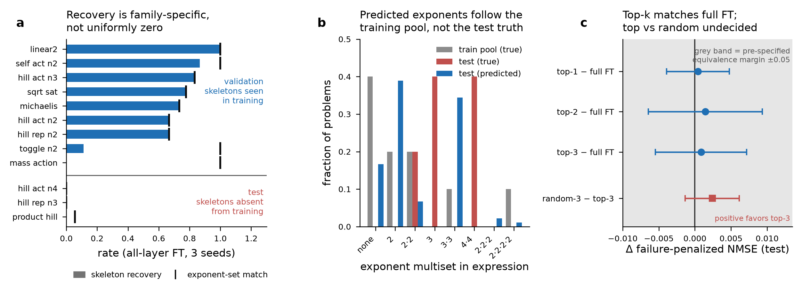
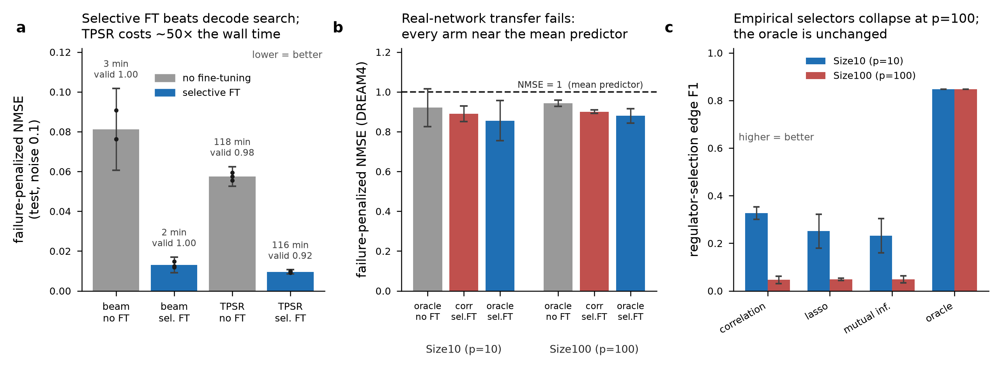
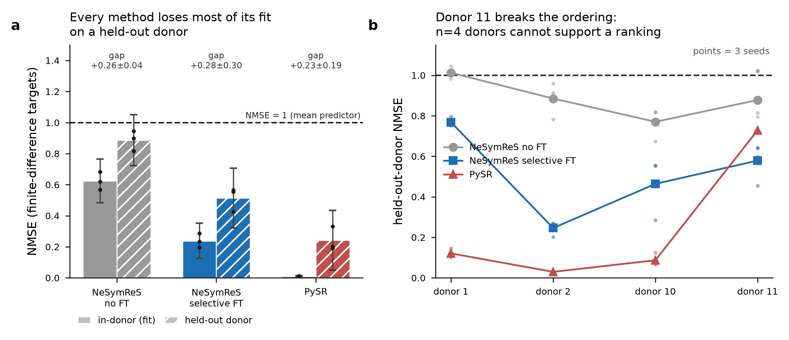

# GPU_RUN1 再解析レポート — 保存済み結果の独立検証と批判的レビュー

対象: `results/runs/colab_reduced_20260729_03`（GPU_RUN1、3 seeds、noise 0.1、reduced run）
世代: **GPU_RUN1 のみ**。CPU pilot の数値は一切混在させていない。
方法: リポジトリに保存された JSON（`phase4_multiseed/`, `phase5_multiseed/`, `phase5_seed{0,1,2}/`,
`phase6_noise_multiseed/`, `phase7_multiseed/`, `phase8_lodo_seed{0,1,2}/`, `phase8_pysr_seed{0,1,2}/`）と
合成データ suite index (`results/runs/colab_reduced_20260729_03/input_data/diverse_gpu_n0.1/index.json`) を読み直し、
per-problem レベルで再集計した。新規の学習・推論は行っていない。

---

## 0. 要旨

本再解析の中心的な発見は、**「symbolic recovery は全条件で 0」という現行の記述が、
GPU_RUN1 のデータの実態を正確に表していない**ことである。test 集合では確かに全条件 0 だが、
その test 集合は訓練に一切含まれない 5 つの式骨格のみで構成されており、
0 という値は「fine-tuning が式回復に効かない」ことではなく
「訓練分布外の骨格へ外挿できない」ことを測っている。
一方 validation 集合では全層 fine-tuning の skeleton recovery が $0.653$ に達し、
層別に単調な差（`decoder_3` $0.528$ → `encoder_*` $\approx 0.11$ → pretrained $0.000$）を示す。
つまり式回復指標は**層別役割の解明という主目標に対して有効な信号を既に持っている**。
これは主結果に昇格させるべき情報である。

同時に、以下の 3 点は現行の主張を弱める方向に働く。

1. equivalence margin $0.05$ は fine-tuning 全体の効果 $0.0793$ の $63\%$ に相当し、緩すぎる。
2. 中核仮説（寄与上位層の選択が無作為層より優れる）は**未支持**（$+0.0024 \pm 0.0037$、CI が 0 を跨ぐ）。
3. DREAM4 では oracle regulators を与えても penalized NMSE が $0.86$–$0.94$ にとどまる。
   regulator selection を改善しても転移は改善しない、という示唆であり、
   現行 README が最重要課題として挙げる Size100 の selector 問題は優先順位を下げるべきである。

---

## 1. 重大度 1 — symbolic recovery = 0 の分解: 二つの異質な原因

### 1.1 事実: test 集合には訓練骨格が一つも含まれない

suite index を骨格単位で照合した結果（式 ID から末尾のインスタンス番号を除去して骨格を同定）:

| split | 問題数 | 骨格 |
|---|---|---|
| train | 120 | `additive_act`, `hill_act_n2`, `hill_act_n3`, `hill_rep_n2`, `linear2`, `mass_action`, `michaelis`, `self_act_n2`, `sqrt_sat`, `toggle_n2` |
| test | 60 | `hill_act_n4`, `hill_rep_n3`, `product_hill`, `ratio_xy`, `sum_linear3` |

**train ∩ test = ∅**（骨格レベルで完全に分離）。これはリーク防止としては正しい設計だが、
評価設計としては「未知の関数族への外挿」という最も困難な条件だけを test にしている。

### 1.2 事実: validation では recovery が層別に単調

`phase4_multiseed/equations_seed{0,1,2}.json` の per-problem 記録（各条件 $n=72$ = 24 問 × 3 seeds）:

| 条件 | skeleton | exact | equiv | median NMSE |
|---|---|---|---|---|
| all_params | **0.653** | 0.000 | 0.000 | 0.0081 |
| decoder_3 | 0.528 | 0.000 | 0.000 | 0.0081 |
| decoder_2 | 0.431 | 0.000 | 0.000 | 0.0090 |
| decoder_4 | 0.403 | 0.000 | 0.000 | 0.0090 |
| decoder_1 | 0.111 | 0.000 | 0.000 | 0.0110 |
| encoder_5 | 0.139 | 0.000 | 0.000 | 0.0313 |
| encoder_0 / decoder_0 / output_head | 0.000 | 0.000 | 0.000 | 0.032–0.043 |
| pretrained | 0.000 | 0.000 | 0.000 | 0.0545 |

層別ランキング（`val_ce` スコア、3 seeds）の順序 `decoder_3` > `decoder_4` > `decoder_2` > `decoder_1` > `encoder_5` > … と
recovery の順序はほぼ一致し、seed 間の順位安定性は `val_ce` で Spearman $0.991$、
`sym_rate` で $0.881$ である。**これは層別役割の解明という主目標に直接使える証拠**であり、
「recovery は全条件 0」という一文で消してはならない。

**ただし解釈の限定**: validation は motif 単位グループ分割だが、
suite の 180 問はすべて motif 文字列が一意（定数まで埋め込まれているため）であり、
グループ分割は事実上**問題単位のランダム分割に退化**している。
実測すると validation の 9 骨格はすべて残り train 側にも存在する（骨格レベル overlap = 全 9）。
したがって validation recovery は in-distribution 性能であり、骨格汎化を測っていない。
「fine-tuning で式回復が改善した」と書くときは *in-distribution* と明記する必要がある。

### 1.3 事実: exact = 0, equiv = 0 は全条件で成立

recovery は skeleton 一致（定数をプレースホルダに置換した比較）のみで担われている。
literal 一致と sympy 簡約による同値判定はどの条件でも 0 である。
**`sym_recovery` を「式回復率」と呼ぶのは過大**で、`skeleton_recovery` と呼ぶべきである。

### 1.4 test の 0 の原因は二つに分かれる

再解析で、test の 0 は単一原因ではないことが判明した。

**(A) 協調性次数の外挿失敗（真の構造的失敗）**
指数の多重集合の分布を比較すると:

| 指数多重集合 | train pool (真) | test (真) | test (予測) |
|---|---|---|---|
| なし | 0.400 | 0.000 | 0.167 |
| $\{2\}$ | 0.200 | 0.000 | 0.389 |
| $\{2,2\}$ | 0.200 | 0.200 | 0.067 |
| $\{3\}$ | 0.000 | **0.400** | 0.000 |
| $\{3,3\}$ | 0.100 | 0.000 | 0.344 |
| $\{4,4\}$ | 0.000 | **0.400** | 0.000 |

test の真値が要求する $\{3\}$ と $\{4,4\}$ は train pool に存在せず、予測は一度も出力していない。
予測は train pool にある $\{2\}$ と $\{3,3\}$ に集中する。
`hill_act_n4` / `hill_rep_n3` では有理関数の形と変数集合は正しく再現されている
（variable F1 は validation 全条件で $0.92$–$1.00$）が、Hill 係数だけが訓練分布に張り付く。
**これは真の失敗であり、pretraining 分布の設計問題である。**

**(B) 因数分解・定数吸収に対する指標の非感応性（指標側の問題）**
validation の `mass_action` は指数集合一致 $1.00$ にもかかわらず skeleton recovery $0.000$、
`toggle_n2` は指数集合一致 $1.00$ に対し skeleton $0.111$ である。
予測式を目視確認すると、代数的に同値だが異なる因数分解形、
あるいは小さな加法オフセットを因子に吸収した形を出力しており、
定数プレースホルダ比較ではこれが打ち消されない。
（注: `mass_action` は $x \cdot y$ 型で指数を持たないため、指数集合一致 $1.00$ は自明であり、
この行の一致は情報量が小さい。）
**したがってこれらの族の 0 の一部は modelling failure ではなく metric artifact である。**

### 1.5 研究結果への影響

- 「symbolic recovery は全条件で 0 であった」は、**test に限った記述であることを明示しないと誤導的**である。
- GPU_RUN2 では test 集合を「訓練骨格の held-out インスタンス」と
  「未知骨格」の 2 層に分け、両者を別々に報告すべきである。前者がなければ
  fine-tuning の式回復への寄与を測れず、後者がなければ外挿限界を測れない。
- skeleton 比較を代数正規形（sympy の `simplify`/`factor` 後の比較、または
  係数を自由変数として構造同型を判定する方式）に置き換えれば、
  `mass_action`/`toggle_n2` の artifact 分は回復する。実装コストは小さい。

---

## 2. 重大度 2 — 統計設計: margin が緩く、中核仮説は未支持

### 2.1 equivalence margin $0.05$ は fine-tuning の効果の $63\%$

`phase5_multiseed/summary.json` の事前指定 margin は penalized NMSE で $0.05$。
一方 test 上の fine-tuning 全体の効果は

$$\text{pretrained} - \text{all\_params} = 0.0935 - 0.0142 = 0.0793.$$

$0.05 / 0.0793 = 0.63$。すなわち「full FT の効果の 6 割を失っても同等と宣言できる」設計である。
top-$k$ が同等と判定されたこと自体は正しいが、margin が緩いため主張の強度が低い。

**救いとなる事実**: 実測の paired CI は非常に狭い。top-$k$ − full FT の上側信頼限界の最大値は
$0.0093$（top-2）で、これは fine-tuning 効果の $11.7\%$ にすぎない。
したがって margin を $0.02$（効果の $25\%$）に設定しても同等性の結論は保たれる。
**事後に margin を変更してはならない**が、GPU_RUN2 では $0.02$ を事前登録すべきである。

| 比較 | 平均差 | 95% CI (Student $t$, $n=3$) | 判定 |
|---|---|---|---|
| top-1 − full FT | $+0.0004$ | $[-0.0039, +0.0048]$ | 同等（margin 内） |
| top-2 − full FT | $+0.0014$ | $[-0.0064, +0.0093]$ | 同等（margin 内） |
| top-3 − full FT | $+0.0009$ | $[-0.0055, +0.0072]$ | 同等（margin 内） |

### 2.2 中核仮説（層選択の優越）は未支持

random-3 − top-3 の改善量は $+0.0024 \pm 0.0037$（$n=3$、Student $t$）で **CI が 0 を跨ぐ**。
条件別の penalized NMSE は top_3 $0.0150$、random_3 系 3 条件が $0.0188 / 0.0168 / 0.0167$（平均 $0.0174$）。
符号は仮説を支持する向きだが、**有意ではない**。

一方で bottom_3 は $0.0246$ と明確に劣り、middle_3 は $0.0161$ である。
つまり「どの 3 層でも同じ」ではないが、「上位 3 層が無作為 3 層より優れる」は示せていない。

**設計上の原因**: 12 層から 3 層を無作為抽出すると、
寄与上位の decoder 層（6 層中）を少なくとも 1 つ含む確率が高く、
random baseline が強すぎる。GPU_RUN2 では
(i) encoder のみからの無作為抽出、(ii) 寄与下位からの抽出を対照に加え、
(iii) 無作為 draw 数を 3 から 10 以上に増やすべきである。
現状は無作為 draw が 3 本、seed が 3 本しかなく、検出力が不足している。

---

## 3. 重大度 3 — DREAM4 転移: selector を直しても転移は直らない

`phase7_multiseed/summary.json`（3 seeds × network 1–3、network 4–5 は compute budget により除外。
`curtailment.json` は選択が完了順であり指標に基づかないことを明記している — この点は適切）。

| size | 条件 | penalized NMSE | valid rate |
|---|---|---|---|
| Size10 | oracle regulators, FT なし | $0.921 \pm 0.095$ | 0.978 |
| Size10 | correlation selector + selective FT | $0.890 \pm 0.039$ | 0.789 |
| Size10 | oracle regulators + selective FT | $0.855 \pm 0.100$ | 0.933 |
| Size100 | oracle regulators, FT なし | $0.943 \pm 0.015$ | 0.999 |
| Size100 | correlation selector + selective FT | $0.901 \pm 0.008$ | 0.873 |
| Size100 | oracle regulators + selective FT | $0.879 \pm 0.036$ | 0.908 |

regulator selection の edge F1 は Size10 で correlation $0.33$、lasso $0.25$、mutual information $0.23$、
oracle $0.85$。Size100 では経験的 selector 3 種がすべて $0.048$–$0.052$ に崩壊し、
oracle は $0.85$ のまま変わらない。

### 決定的な点

**oracle regulators を与えても penalized NMSE は $0.855$–$0.879$、
すなわち平均予測器（NMSE $=1$）をわずかに下回るだけである。**
regulator selection は完全に解決した状態（F1 $=0.85$）を与えても転移性能は改善しない。
したがって残る原因は selector ではなく、以下のいずれかである。

1. 有限差分ターゲットが真の ODE 微分の代理として質が低い。
2. NeSymReS の pretraining 分布（低次元・少数演算子・平滑な関数）が DREAM4 の生成過程から遠すぎる。
3. DREAM4 の時系列が 21 時点 × 10 replicate 規模であり、
   $p=100$ で target あたり有効サンプルが不足している。

**研究結果への影響**: README が未解決の主要課題の先頭に置く
「DREAM4 Size100 の regulator selection（経験的 F1 $\approx 0.05$、oracle $\approx 0.85$）」は、
**転移失敗のボトルネックではない**。GPU_RUN2 では selector 改良に資源を割く前に、
(a) 微分推定法の比較（有限差分 vs スプライン平滑化 vs 積分形式の弱形式定式化）、
(b) 合成 DREAM4-like データでの sanity check（真の ODE 微分を与えた場合に NMSE が下がるか）
を先に実施すべきである。特に (b) は、NMSE $\approx 0.9$ が
微分推定の問題かモデルの問題かを切り分ける最小の実験である。

---

## 4. 重大度 4 — ヒトデータ demo: budget 不統一で方法比較として不成立

`phase8_lodo_seed{0,1,2}/lodo_results.json` と `phase8_pysr_seed{0,1,2}/pysr_results.json`
（GSE112372、20 遺伝子、4 donors、leave-one-donor-out、3 seeds）。

| 方法 | in-donor NMSE | held-out donor NMSE | gap |
|---|---|---|---|
| NeSymReS, FT なし | $0.62 \pm 0.13$ | $0.88 \pm 0.16$ | $+0.26 \pm 0.04$ |
| NeSymReS, selective FT | $0.24 \pm 0.11$ | $0.51 \pm 0.19$ | $+0.28 \pm 0.30$ |
| PySR | $0.011 \pm 0.003$ | $0.24 \pm 0.19$ | $+0.23 \pm 0.19$ |

### 4.1 budget が統一されていない

PySR は `pysr_iterations = 12`、`search_timeout_sec = 15`、`execution = local_cpu`。
NeSymReS 側は `decode_timeout_sec = 30` に GPU 上の selective fine-tuning が加わる。
**計算 budget が桁で異なり、この 3 者比較は方法の優劣を示す証拠にならない。**
表に載せる場合は「budget 未統一の参考値」と明記が必要である。

### 4.2 donor 11 で順序が逆転する

per-fold 記録を donor 別に再集計すると、PySR の holdout NMSE は
donor 1 $0.121$、donor 2 $0.030$、donor 10 $0.087$ に対し **donor 11 で $0.729$** と急上昇し、
selective FT NeSymReS（donor 11 で $0.579$）に逆転される。
$n=4$ donors では方法の順位づけはできない。
また PySR の in-donor $0.011$ は holdout の $22$ 倍良く、過剰適合の典型である。

### 4.3 in-donor 値の解釈

`decode_reuse` フィールドは "one training decode scored in-donor and holdout" と記録している。
すなわち in-donor と holdout は同一の decode 結果を評価しており、
in-donor は「訓練データ上の当てはまり」である。gap を汎化ギャップとして読むのは妥当だが、
式選択が in-donor 上で行われている場合、in-donor 値は楽観的である。
現状の記録からはこの点が判定できないため、GPU_RUN2 では
in-donor 内にさらに式選択用の内部 holdout を設けるべきである。

---

## 5. 重大度 5 — TPSR: 50 倍のコストに対する利得は fine-tuning 後に消える

`phase6_noise_multiseed`（noise 0.1、3 seeds、test）:

| 方法 | penalized NMSE | valid rate | 実時間 |
|---|---|---|---|
| beam, FT なし | $0.0811$ | 1.000 | 2.6 分 |
| beam, selective FT | $0.0131$ | 1.000 | 2.1 分 |
| TPSR, FT なし | $0.0575$ | 0.983 | 117.7 分 |
| TPSR, selective FT | $0.0096$ | 0.921 | 116.5 分 |

paired effects（$n=3$、Student $t$）:

| 効果 | 平均 | 95% CI |
|---|---|---|
| FT 効果（beam 内） | $+0.0681$ | $\pm 0.0167$ |
| FT 効果（TPSR 内） | $+0.0479$ | $\pm 0.0040$ |
| TPSR 効果（FT なし） | $+0.0237$ | $\pm 0.0212$ |
| TPSR 効果（selective FT 後） | $+0.0035$ | $\pm 0.0038$（CI が 0 を跨ぐ） |
| 交互作用 | $-0.0202$ | $\pm 0.0175$（CI が 0 を含まない） |

**主張可能な結果**: 交互作用の CI は 0 を含まず、
selective fine-tuning 後には TPSR の追加利得が有意に縮小する。
selective FT + beam（$0.0131$、2.1 分）は pretrained + TPSR（$0.0575$、117.7 分）より良い。
すなわち**層選択 fine-tuning は decode 時探索の必要性を下げる**。
これは計算効率の主張として GPU_RUN1 から出せる、数少ない有意な結論である。

**注意**: TPSR は valid rate を下げる（selective FT 下で $0.921$）。
成功例のみの指標では TPSR が過大評価されるため、
penalized 指標で比較している現行設計は正しい。

---

## 6. 図


**図 1.** 単層 fine-tuning の寄与プロファイル（validation、3 seeds）。
点は各 seed、区間は Student $t$ による 95% CI。
decoder 中位層（`decoder_2`–`decoder_4`）に寄与が集中し、
encoder 層と `output_head` は pretrained からほとんど改善しない。
seed 間の順位安定性は Spearman $0.991$（`val_ce`）。



**図 2.** (a) 族別の skeleton recovery（全層 FT、3 seeds）。上段は validation（訓練済み骨格）、
下段は test（未知骨格）。縦棒は指数多重集合の一致率。
`mass_action`・`toggle_n2` は指数一致 $1.00$ に対し skeleton がほぼ 0 で、指標の非感応性を示す。
(b) 指数多重集合の分布。予測は訓練 pool の分布に従い、test の真値（$\{3\}$, $\{4,4\}$）を出力しない。
(c) 事前指定 margin $\pm 0.05$（灰帯）に対する paired 差。top-$k$ は全て同等、
random-3 − top-3 は CI が 0 を跨ぐ。



**図 3.** (a) noise 0.1 における探索法 × fine-tuning。数値は平均実時間と valid rate。
(b) DREAM4 転移。破線は平均予測器（NMSE $=1$）。oracle regulators でも改善は小さい。
(c) regulator selection の edge F1。経験的 selector は $p=100$ で崩壊し、oracle は不変。



**図 4.** GSE112372（20 遺伝子、4 donors、3 seeds）。
(a) in-donor と held-out donor の NMSE。PySR の in-donor は holdout の $1/22$ で過剰適合。
(b) donor 別の holdout NMSE。donor 11 で方法の順序が逆転する。
budget は方法間で統一されていない（PySR: 12 iterations / 15 秒 / CPU、
NeSymReS: decode 30 秒 + GPU fine-tuning）。

---

## 7. GPU_RUN2 への提案（優先順位順）

**科学的に望ましく、かつこのリポジトリで実装可能**

1. **test 集合を 2 層化する。** 訓練骨格の held-out インスタンスと未知骨格を分離し、
   recovery を別々に報告する。suite 生成器の変更のみで済み、計算コストは小さい。
2. **skeleton 比較を代数正規形化する。** sympy による正規化（`factor`/`cancel` 後の比較、
   または係数を自由変数とした構造同型判定）に置き換え、
   因数分解違いによる偽陰性を除去する。既存の per-problem 記録に対して再集計可能で、
   再学習は不要である。
3. **equivalence margin を $0.02$ に事前登録する。** GPU_RUN1 の CI 幅（最大 $0.0093$）から、
   この margin でも同等性の結論は保たれると予測される。
4. **random baseline を強化する。** encoder のみ無作為、寄与下位無作為を対照に追加し、
   無作為 draw を 10 本以上に増やす。3 seeds のままでも検出力は改善する。
5. **微分推定の sanity check。** DREAM4-like 合成系で真の ODE 微分を与えた場合の NMSE を測り、
   $0.9$ という数値が微分推定由来かモデル由来かを切り分ける。
   これは selector 改良より優先度が高い。
6. **budget を統一した比較 protocol。** wall-clock または関数評価回数で
   NeSymReS / TPSR / PySR を揃える。現状の PySR 設定（12 iterations、15 秒）は
   PySR の実力を明らかに下回っている。

**科学的に望ましいが、現状の資源では実装困難**

- pretraining 分布に高次 Hill 係数（$n=3,4$）を含めた再事前学習。
  NeSymReS の pretraining は本研究の計算 budget を大きく超える。
  代替として、Hill 係数を明示的な入力として与える条件付き decode か、
  推定後に指数のみを数値最適化する後処理が現実的である。
- donor 数の増加。GSE112372 は 4 donors が上限であり、
  順位づけを支える検出力を得るには別コホートの追加が必要になる。
- DREAM4 network 4–5 を含む完全 run。GPU_RUN1 では compute budget により除外されており、
  完遂には現行の約 1.7 倍の GPU 時間を要する。

---

## 8. 本レポートの限界

- 新規の学習・推論を行っていない。すべて保存済み JSON の再集計である。
- `sym_*` 指標は保存済み per-problem 記録の値を用いており、
  sympy による再計算はしていない。第 1.4 節 (B) の因数分解・定数吸収の判定は
  予測式文字列の目視確認に基づく定性的所見であり、定量化には正規形比較の実装が必要である。
- 統計はすべて $n=3$ seeds（DREAM4 は 3 seeds × 3 networks、
  ヒトは 3 seeds × 4 donors）の Student $t$ 区間であり、
  区間幅は真の不確実性を過小評価している可能性がある。
- 図中のテキストは英語である（実行環境に CJK フォントがなく、
  日本語がすべて豆腐になったため）。

---

## 9. 本レポートの成果物と再現手順

### 生成物

| path | 内容 |
|---|---|
| `graphs/colab_reduced_20260729_03/figures/phase4_layer_contribution.png` (+`.svg`) | 図1 単層 fine-tuning の寄与プロファイル（validation、penalized NMSE と val CE） |
| `graphs/colab_reduced_20260729_03/figures/phase45_recovery_and_equivalence.png` (+`.svg`) | 図2 骨格別 recovery、指数多重集合分布、事前指定 margin に対する paired 差 |
| `graphs/colab_reduced_20260729_03/figures/phase67_baselines_and_transfer.png` (+`.svg`) | 図3 探索法×FT の 2×2、DREAM4 転移、regulator selection edge F1 |
| `graphs/colab_reduced_20260729_03/figures/phase8_human_lodo.png` (+`.svg`) | 図4 ヒトデータ leave-one-donor-out（方法別・donor 別） |
| `graphs/colab_reduced_20260729_03/tables/phase45_condition_summary.csv` | validation 層別 recovery と test 条件別 penalized NMSE の統合表（`split` 列で世代・split を区別） |
| `graphs/colab_reduced_20260729_03/tables/phase45_skeleton_recovery.csv` | 骨格別 skeleton recovery と指数集合一致率 |
| `graphs/colab_reduced_20260729_03/tables/phase8_human_per_donor.csv` | donor 別・方法別の in-donor / holdout NMSE（3 seeds の mean/std） |

### 再現

```bash
python GPU_RUN1/scripts/reanalysis_figures.py \
    --run-id colab_reduced_20260729_03 \
    --suite diverse_gpu_n0.1 \
    --seeds 0 1 2
```

入力は `results/runs/<run-id>/` 配下の保存済み JSON と、同 run に同梱された
`input_data/<suite>/index.json` のみである。学習・推論は行わない。
図表中の数値はすべてこのスクリプトが JSON から生成しており、
本文中の数値も同じ集計に基づく（AGENTS.md 6.2「レポートの数値は保存済み JSON/CSV から生成または照合する」）。

依存は numpy、pandas、matplotlib のみである。Student $t$ の臨界値は
scipy 非依存にするため $df \le 10$ の表引きで実装している
（本 run はすべて $n=3$、すなわち $df=2$）。
